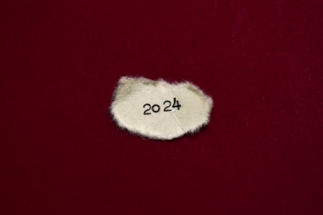
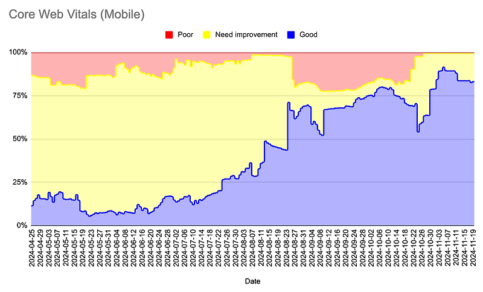
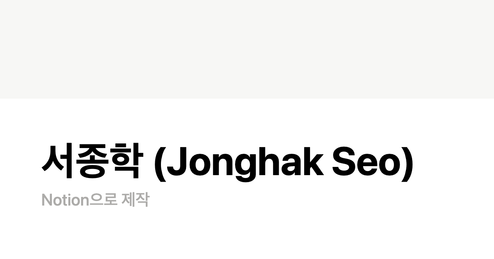
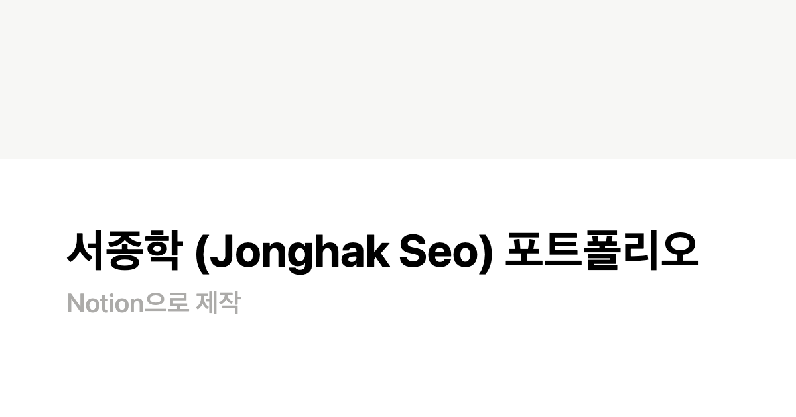
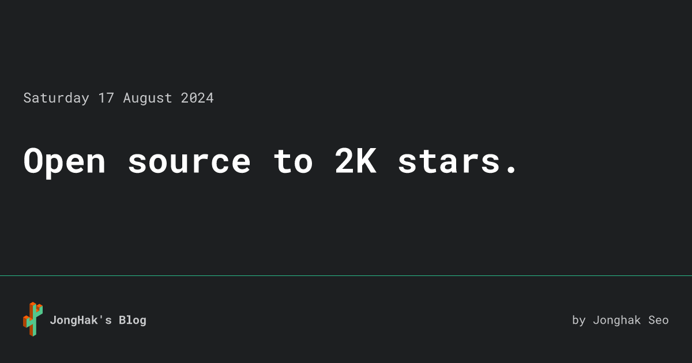
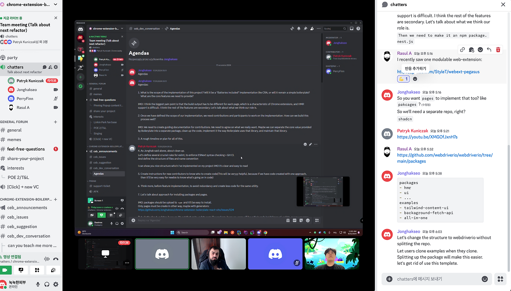

2023년 회고를 작성했던 기억이 엊그제 같은데 벌써 2025년의 첫 달도 훌쩍 지나갔다.

2023년에는 내가 스스로 어떤 사람인지 좀 더 깊이 이해하고 내면의 성장을 이뤘다면 2024년에는 내면의 성장을 바탕으로 보다 즐겁고 의미 있게 한 해를 보냈다.

## 파트 리더

재작년 말, 프론트엔드 파트 리드를 맡게 되었다. 한 해를 돌아보며 나름대로 성공적인 파트 리더 업무 수행이었다고 자평하지만 그 과정에서의 고민과 갈등도 참 많았다.

구성원들의 동기부여를 위해 꾸준히 1:1 면담을 진행하며 이런저런 팀 단합 시간을 만들었고, 소통에서의 오해를 줄이고 합리적으로 커뮤니케이션을 하기 위해 신경을 많이 기울였다. 6개월 간격으로 리더십에 대한 익명 설문을 통해 내가 잘못된 방향으로 가고 있지는 않은지 돌아보았고, 나태해지지 않기 위해 노력했지만 그래도 1년 내내 같은 텐션으로 임하지는 못했던 것 같다. 어쨌든 파트원들과 함께 생산성을 개선하고 한 명의 이탈자도 만들지 않았던 부분은 성공이었다고 자평하고 싶다.

성장에 대한 욕구가 크고 주도적인 인원들이 모이는 스타트업의 특성상 구성원들에게 성장하고 있다는 감각을 주는 것이 유지에 매우 중요하다고 생각하는데, 구성원들의 성장을 위한 여러 스터디(리액트 소스 코드, 라이브러리 소스 코드 탐구, 기술 서적 함께 읽기)를 성공적으로 진행했던 것이 큰 도움이 되었다고 생각한다. 그 밖에도 정비 스프린트에서 구성원들이 자율성을 갖고 진행한 태스크들로 업무 성취감을 얻는다든지, 페어 프로그래밍을 통한 업무 유대감 증진 등도 도움이 되었을 것 같다.

## KR 초과 달성

작년 프론트엔드 파트의 KR이었던 웹 바이탈 개선 목표를 초과달성하며 큰 효능감을 느꼈다.

[https://nookpi.tistory.com/209](https://nookpi.tistory.com/209)

기존 웹 바이탈이 워낙 오랫동안 좋지 않았기에 '이게 될까?' 싶은 부분들도 있었지만 여러 시도와 노력으로 드라마틱하게 개선을 할 수 있었다. 무엇보다도 즐거운 일은 관련 작업들(SWR 캐싱 등)이 단순 웹 바이탈 지표 개선에 머무르지 않고 실제 유입량의 증가와 유저 체감 속도에도 큰 영향을 주었다는 점이다.

유저페이지 자체의 성능 향상과 이로 인한 고객 경험 개선이라는 측면에서 스스로에게도 매우 보람찬 일이었다.

## 이력서/포트폴리오 정리

[https://ahead-vanilla-49e.notion.site/Jonghak-Seo-1475b8aea39380889f81ea588df0d1c7](https://ahead-vanilla-49e.notion.site/Jonghak-Seo-1475b8aea39380889f81ea588df0d1c7)

[https://ahead-vanilla-49e.notion.site/Jonghak-Seo-1475b8aea3938087be04e874eb76d6e1](https://ahead-vanilla-49e.notion.site/Jonghak-Seo-1475b8aea3938087be04e874eb76d6e1?pvs=74)

올 한 해를 정리하면서 이력서와 포트폴리오를 한 번 정리했다. 웹 바이탈 개선 작업의 지표가 잘 나와서, 이력서를 정돈한 지 너무 오래되어서 한 해 회고를 겸하여 이번 기회에 다시 작성해보았다. 개인적으로는 만족스럽게 잘 작성한 것 같아 기쁘다. :)

## 오픈소스

크롬 익스텐션 보일러플레이트 오픈소스는 상반기에 아키텍처를 갈아엎어 새로 만들다시피 한 이후로 하반기에는 주로 유지보수와 버그 대응 위주로 대응했다.

Stars 2K를 달성하여 8월에 블로그 포스팅을 올렸는데 곧 3K가 될 것 같다.

[https://jonghakseo.github.io/posts/until-2k-stars/](https://jonghakseo.github.io/posts/until-2k-stars/)

9월에는 디스코드에서 기여해주시는 분들과 팀 미팅을 가지면서 앞으로의 발전 방향에 대해서 논의하는 시간도 가졌는데, 영어 울렁증으로 덜덜 떨면서 시작했으나 다들 제1언어가 영어가 아닌 유럽인들이어서 편하게 이야기를 나눌 수 있었다.

참고로 논의한 내용들은 아직 시작도 못 하고 있다... 올해에는 힘내서 하기로 한 내용들을 다 해봐야지.

## 영어공부

2024년 한 해 꾸준히 영어공부를 했는데 성과가 상당히 있었다. 앞서 언급한 유럽 개발자들과의 팀 미팅은 재작년만 해도 상상할 수 없는 일이었다. 나는 예전부터 영어를 잘하지 못했는데, 개발을 본격적으로 시작하기 전에는 영어 때문에 개발을 제대로 할 수 있을지 고민할 정도였다. 그러니 더더욱 회화는 한 마디도 하지 못했다.

재작년 중순, 미국에 있는 스타트업 팀과 협업할 수 있는 좋은 기회가 있었고, 좋은 제안도 받았지만 언어 장벽과 내가 원하는 도메인의 업무가 아니라는 이유로 거절했다. 그때, 개발자로서 앞으로 좋은 기회가 왔을 때 영어 때문에 발목이 잡히면 안 되겠다는 생각이 들어 재작년 말에 영어 과외를 시작했다.

약 10개월 동안 영어 과외를 하면서 열심히 하거나 많은 시간을 투자하지는 않았지만 꾸준히 했던 것 같고, 영어 회화 실력이 늘어가는 것을 느끼면서 더욱 재미있게 공부했던 것 같다. 작년 말부터는 링글이라는 원어민 대화 플랫폼을 통해 유럽과 미국 등의 튜터들과 대화를 하고 있는데, 꽤 재미있게 잘하고 있다

1년 넘게 영어 공부를 하면서 실력도 많이 늘었지만 (기존에 워낙 못했으니), 무엇보다도 영어 회화에 대한 두려움이나 망설임이 없어진 것이 가장 큰 자산인 것 같다. 올해도 영어 공부를 열심히는 아니어도 최소한 꾸준히 계속할 생각이다.

## 2024 총평

5년차 프론트엔드 개발자라는 타이틀은 참 무서운 것 같다. 3년차, 4년차에는 그렇게 생각하지 않았던 것 같은데... 햇수로 5년이라는 시간 동안 일을 했다면 내가 지금 아는 것, 할 수 있는 것이 높은 수준에 해당하는지 의구심이 든다.

이력서와 포트폴리오를 다듬으면서 한 해를 돌아보니 나름 뭔가 많이 그리고 잘한 것 같은데 내가 느끼는 내 성장 곡선은 예전만큼 가파르지 않은 것 같다. 솔직히... 더 많이, 잘할 수 있었는데 나 스스로 '이 정도면 잘했는데?'라는 생각에 빠져 다소 게을렀다고 생각한다.

올해는 이런 게으름을 걷어내고 작년의 성장 곡선 이상의 각도를 만드는 한 해가 되도록 노력해봐야겠다.
