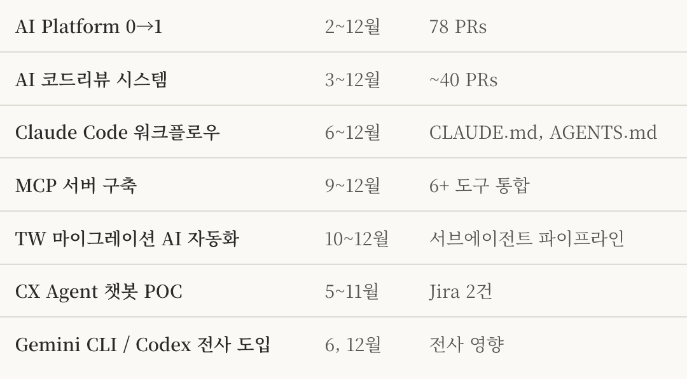
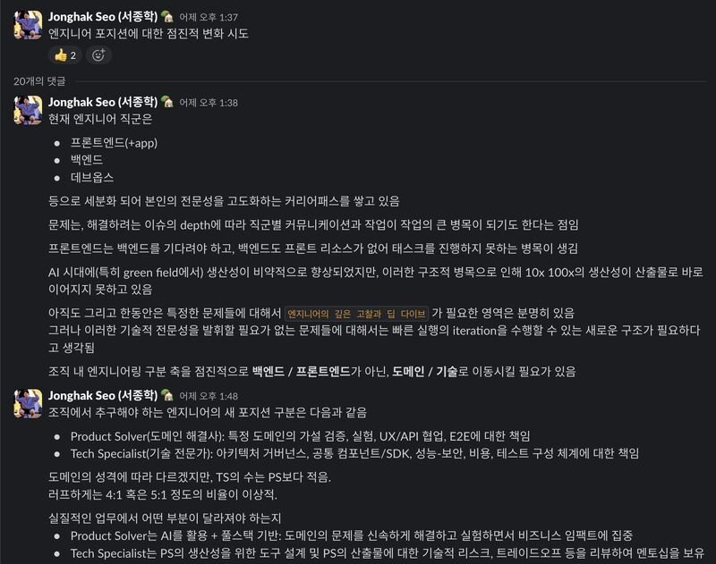
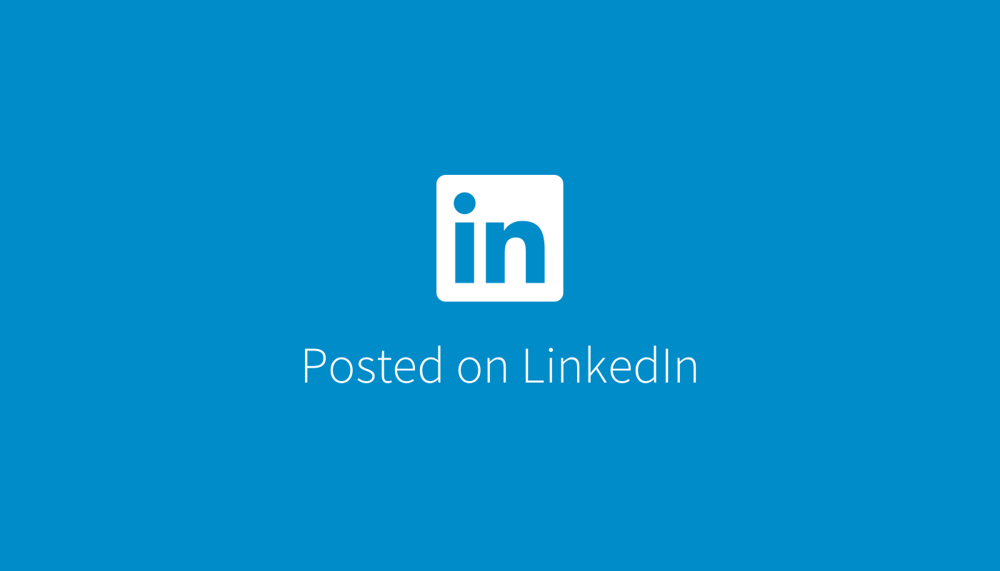
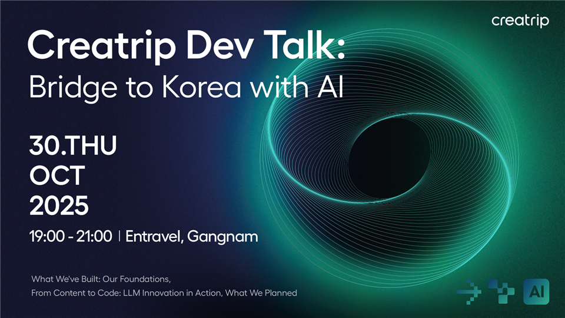
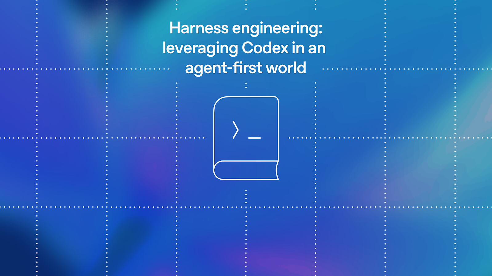
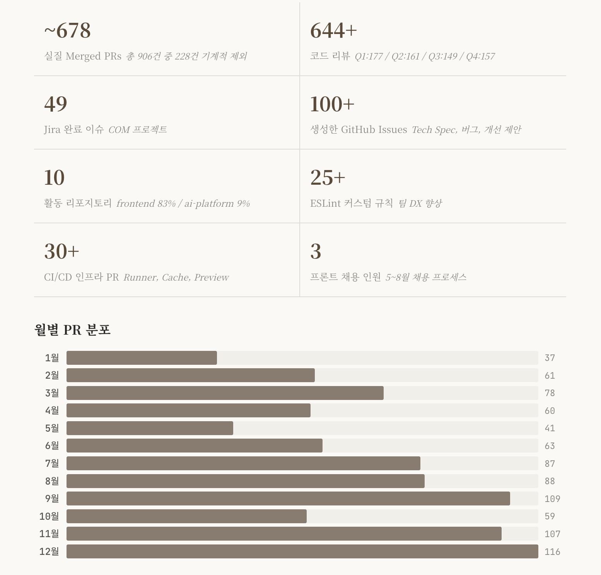

오랜만에 글을 쓰려고 블로그에 들어오니 세 번째로 최신글이 '사내 AI 챗봇 서비스 구축하기'이고, 네 번째 최신글은 2024년 회고글이라니, 내가 한동안 글을 안 쓰긴 했구나 싶다.

요즘엔 글을 쓰고 싶은 주제들이 휙휙 스쳐지나가기만 하고, 실제로 쓸 시간을 갖지는 못하는 것 같다. 돌아보면 남는건 다 글인데...

거두절미하고, 또 잔뜩 늦었지만 2025년 회고를 해보려고 한다.

## AI Platform 구축기

24년도 그랬지만 25년도 AI 이야기를 안 할 수가 없다. 25년은 단순히 AI 사용 뿐만 아니라, 조직 전체가 AI를 쓸 수 있게 플랫폼과 워크플로우를 설계하고 구축하는 해였다.

특히 25년 초에는 사내 AI Platform 구축에 많은 에너지를 쏟았다. 사실 AI Platform은 누가 시켜서 만들거나 회사에서 리소스를 받아서 구축한 서비스가 아니다. 내 퇴근 후의 시간과 주말을 갈아넣은 프로젝트였고 구축하면서 구성원들에게 AI 리터러시 함양, 구독비용 절감, 사내 데이터 가시성 확보 등 여러 성과가 있었다고 자평하지만, 사실 내가 얻은 게 제일 많았다.

현재 AI Platform은 사내 모든 부서(기획, CX, 마케팅, 개발)가 모든 창구(Slack, Web) LLM을 활용할 수 있는 허브가 되었고, 자체 MCP 서버 제공으로 Jira, Google, Slack, Notion, Figma 등의 모든 업무 도구를 쉽게 제공하고 있다.

젠데스크에 들어가는 AI 익스텐션을 만들었는데, 이후 CX팀은 채용 계획을 백지화 했다.

구현하면서 LLM과 관련된 애플리케이션을 만들 때의 어려움이나, 도구를 어떤 식으로 설계해야 하는지, LLM의 비결정성을 어떻게 평가하고 검증해야 하는지, 그게 얼마나 어려운지 등등... 배운 경험이 정말정말 많다.

덕분에 5월(Claude Code 1.0 출시 즈음)에는 자체적으로 구축한 ReasoningLoop를 사용한 DataAgent로 원하는 데이터를 높은 정확도로 가져올 수 있는 환경도 구축했다. DataAgent는 빅쿼리 도구를 들고 있는 AI Platform 내 일종의 서브에이전트다. 지금은 GitHub, DataAgent, BrowserAgent 등 여러 개의 특화 에이전트들이 플랫폼 위에서 잘 동작하고 있다.

브라우저 에이전트를 만들(깎을) 때의 고난의 시간도 새삼 생각이 난다. AI Platform은 기본적으로 AWS에서 돌아가고, 브라우저 에이전트는 헤드리스 크로미움을 쓰기 때문에 봇 탐지 등으로 실제 접근이 어려운 리소스들이 참 많았다. 우회하기 위한 여러 가지 해키한 작업들도 많이 했던 것 같다. 요즘엔 로컬 브라우저의 프로필을 그대로 써서 사실상 봇 탐지가 의미가 없어지는 추세이긴 하지만.. 그땐 그랬지.

12월에는 이 플랫폼이 보안 공격을 당하는 사고도 있었다. RSC 취약점을 통해 크립토마이닝 코드가 심어졌고, 대응 이후 유출 가능성이 있는 환경변수들을 교체하는 작업을 했다. 내가 직접 만든 시스템이 뚫린다는 건 꽤 충격적인 경험이었고, 자책도 많이 했던 것 같다. 그래도 정신을 빠르게 부여잡고 보안패치는 빠르게 해야한다는 뼈저린 교훈을 새겼다.

## 개발팀 리드, AI 시대의 엔지니어?

나 스스로 AI Platform을 구축하면서 AI의 도움을 많이 받긴 했지만(프롬프트나 도구 가시성에 대한 제어, 루프 설계 등 중요한 부분은 내가 하긴 했다) 이 경험이 나한테만 머무르면 안 되겠다는 생각을 했던 것 같다. 개발팀의 방향성에 대해서도 이야기를 많이 하고 의견도 많이 내게 되었다. 그러면서 자연스럽게 개발팀 리드를 해야겠다는 생각을 했다.

그 당시엔 비단 프론트엔드뿐만 아니라 우리 팀의 모든 엔지니어들이 어떤 방향을 향해 가야 하는지가 명확하다고 생각했다. 겪어본 바, 내년에는 개발자가 코드를 작성하지 않게 될 것이 너무나도 자명했고, 심지어는 거의 안 읽게 될 것이라고 생각했다. 엔지니어의 직무적 경쟁력이라는 것이 여러 가지가 있지만, 그중 큰 부분 중 하나가 요구사항을 코드로 옮기는 스킬이었다는 것은 부정할 수 없을 것이다.

나는 엔지니어들이 양극화될 것으로 생각했다. 코어 레벨에서 LLM이 알고 있는 기존의 패턴으로는 해결할 수 없는 문제들을 정말 고도의 집중력과 사고력으로 풀어내는 개발자들과, 프로덕트 관점의 엔지니어.

[https://blog.pragmaticengineer.com/the-product-minded-engineer/](https://blog.pragmaticengineer.com/the-product-minded-engineer)

자연스럽게 후자의 방향을 생각했다. 전자는 LLM과 경쟁을 해야 하고, 후자는 그래도 사람들과 경쟁해야 하는 영역이라고 생각했으니까. 그런 관점에서 이런저런 이야기를 많이 했던 것 같다.

[늘 고민이 많은 요즘입니다. 오늘은 부끄럽지만(...) 제가 저희 엔지니어 팀 슬랙 채널에 공유했던 글 - LinkedIn](https://www.linkedin.com/posts/jong-hak-seo-9142ba200_%EB%8A%98-%EA%B3%A0%EB%AF%BC%EC%9D%B4-%EB%A7%8E%EC%9D%80-%EC%9A%94%EC%A6%98%EC%9E%85%EB%8B%88%EB%8B%A4-%EC%98%A4%EB%8A%98%EC%9D%80-%EB%B6%80%EB%81%84%EB%9F%BD%EC%A7%80%EB%A7%8C-%EC%A0%9C%EA%B0%80-%EC%A0%80%ED%9D%AC-%EC%97%94%EC%A7%80%EB%8B%88%EC%96%B4-activity-7371086850830069760-CaI3?utm_source=share&utm_medium=member_desktop&rcm=ACoAADNNW6AB2kgn3BEW5sUgd8sS2ncRm538MEk)

## 채용, 팀 리빌딩

채용 과제도 AI를 적극적으로 쓰고, 대신 프롬프트를 첨부해달라고 나름 그 당시엔 파격적으로 진행해봤는데 굉장히 경험이 좋았다. 결국 우리가 알고자 하는 건 같이 일하는 구성원이 어떤 사고를 하며 일을 하는지인데, 그게 프롬프트에 다 드러나더라. 사실 기술 수준이나 그 사람의 기준 같은 것도 다 프롬프트에 드러났던 것 같다.

[[크리에이트립 프론트엔드 채용 과제를 살짝 공개(?)합니다] - LinkedIn](https://www.linkedin.com/posts/jong-hak-seo-9142ba200_%ED%81%AC%EB%A6%AC%EC%97%90%EC%9D%B4%ED%8A%B8%EB%A6%BD-%ED%94%84%EB%A1%A0%ED%8A%B8%EC%97%94%EB%93%9C-%EC%B1%84%EC%9A%A9-%EA%B3%BC%EC%A0%9C%EB%A5%BC-%EC%82%B4%EC%A7%9D-%EA%B3%B5%EA%B0%9C%ED%95%A9%EB%8B%88%EB%8B%A4-%ED%81%AC%EB%A6%AC%EC%97%90%EC%9D%B4%ED%8A%B8%EB%A6%BD%EC%9D%98-activity-7351433034027487233-Si_A?utm_source=share&utm_medium=member_desktop&rcm=ACoAADNNW6AB2kgn3BEW5sUgd8sS2ncRm538MEk)

지금 생각해도, 덕분에 새 시대에 맞는 정말 훌륭한 프론트엔드 엔지니어분들을 채용해서 참 다행이라고 생각한다.

개발자분들에게는 계속 프로덕트를 더 많이 사용해보고, 타 팀과 이야기해서 병목을 적극적으로 찾아보라고 이야기를 했다. 부끄러운 이야기지만 우리 프로덕트 팀은 도그푸딩을 거의 하지 않았다. 내가 있었던 4년간의 시간 동안 프로덕트의 탐색-예약-구매-리뷰 사이클을 돌려본 구성원이 거의 없었으니까... 변명이지만, 한국을 여행하는 외국인 여행객을 위한 플랫폼이라는 점이 뭔가 좋은 핑계거리가 되었던 것 같다.

아무튼 개발 리드라는 자리에서 좀 더 발언권이 생긴 참에, 개발자분들을 이끌고 프로덕트의 도그푸딩을 진행했다. 사실 정량적인 결과로 나온 프로덕트 개선안들보다 더 중요한 건, 그 경험 자체라고 생각한다. 내가 만드는 프로덕트가 어떻게 사용되고, 어떤 문제를 해결하고, 어떤 지점이 불편한지에 대한 감각. 새 시대의 엔지니어에겐 그런 감각이 필요하다고 생각했다.

한편 매번 채용에서 겪는 어려움을 타파하고자, 개발팀 자체의 브랜딩에 대해서도 노력을 쏟았던 것 같다. 그 일환으로 개발팀의 3, 4분기 예산과 일부 엔지니어들의 노력을 통해 Dev Talk라는 이름의 개발 밋업도 진행했다.

[Creatrip Dev Talk - 이벤터스](https://event-us.kr/creatripdev/event/113880?utm_source=sms&utm_medium=dm&utm_campaign=bhzaaaaaza)

이후 채용에서의 지원이 소폭 늘어난 것과, 크리에이트립 개발팀의 인지도 향상이라는 성과에 비해서 생각보다 더 리소스가 많이 들어갔던 것 같아서.. 미래에 한 번 더 진행이 될지는 모르겠다.

## 프로덕트 엔지니어로의 전환

하반기에는 개발팀의 프로덕트 엔지니어 전환에 대한 구상도 했다. AI을 사용하면서 생산성이 늘어나도, 결국 백엔드-프론트엔드라는 소통 지점이 병목이 되는 것을 꾸준히 느꼈다. 내가 5년차 프론트엔드 개발자로 하는 것들의 90%를 AI가 해주는 것 같은데, 나머지 10%를 위해 나라는 사람의 리소스를 써야 하나? 엔지니어들은 그 나머지 10%를 메꿔주는 시스템을 구축하는 데 신경 쓰고, 그냥 모든 엔지니어가 직군에 갇히지 않는 기능 구현을 하면 안 되나? 아니 더 나아가서 모든 PM들이 기능을 구현할 수 있는 시스템을 엔지니어들이 만들고 유지보수하는 게 레버리지가 더 높지 않을까?

하는 생각이 강하게 들어 관련 작업들을 했다.

프로덕트 레포에서 암묵지를 발견할 때마다 ESLint 룰로 만들어서 잠갔고, 룰로 잡기 어려운 건 가이드라인 문서로 남겨 동적으로 참조할 수 있는 구조를 만들었다.. 돌아보니 한 해 동안 커스텀 ESLint 규칙만 30건 넘게 추가했다. 최근에 다른 글들을 보니 비슷한 경험을 하는 사람들은 비슷한 결론에 도달하는구나 싶다.

[https://www.anthropic.com/engineering/effective-harnesses-for-long-running-agents](https://www.anthropic.com/engineering/effective-harnesses-for-long-running-agents)

[https://openai.com/index/harness-engineering/](https://openai.com/index/harness-engineering/)

한편 엔지니어분들도 타 직군의 익숙하지 않은 기술에 대해 빠르게 이해도를 높이고 AI에 대한 제어 혹은 감사 능력을 갖기 위해 매주 세미나를 진행했다(지금도 하고 있다).

## 그래도 사실 나는 코드가 좋다

이것들과 별개로 나는 우리 프로덕트팀에서 아직도 제일 많은 커밋과 PR을 올리는 개인 기여자이기도 하다. 나 스스로가 문제 해결에 대한 감각을 놓치지 않아야 팀의 방향성을 가늠할 수 있는 감각이 유지되기 때문이기도 하고, 애초에 나는 일을 하는 게 즐겁다.

AI와 함께하는 생산성 향상?

올해도 굵직한 작업들이 많았다. styled-components에서 TailwindCSS로의 전사 마이그레이션을 AI 자동화 파이프라인까지 만들어가며 10개월에 걸쳐 완주했고, 지도 도메인이라는 완전히 새로운 서비스를 Phase별로 쪼개서 1.5개월 만에 릴리즈하기도 했다.

3년 전 리액트 소스코드를 보고 공부한 지식을 바탕으로 다른 팀원들이 감을 못 잡는 복잡한 버그를 여러 종류의 렌더 페이즈의 호출 순서를 설명하며 해결해낼 때도 짜릿했고, 2년 전 크롬 devtools를 눈 빠지게 보며 프론트엔드 KR이었던 코어 웹 바이탈을 90%까지 끌어올릴 때에도 짜릿했고, 작년 AI Platform을 구축하고 내가 원하는 워크플로우를 자동화하고, 회의록, 프로젝트, 마켓플레이스, 스킬, 전용 익스텐션 등을 만들어서 구성원들이 사용하는 모습을 볼 때도 짜릿했다. 요즘은 내 모든 LLM 사용 기록을 분석한 결과를 바탕으로 pi agent를 내 생산성이 최대로 나올 수 있는 구조로 커스텀해서 쓰고 있는데, one-shot 프롬프트 하나로 수십 개의 에이전트가 뚝딱뚝딱 거리면서 내가 했을법한 퀄리티의 결과물을 내는 걸 보면 또 짜릿하다.

업무로서 나에게 주어진, 다소 일상적인 태스크들도 참 많았는데 그런 것들도 다는 아니어도 대부분은 재미있게, 퀘스트를 깨듯 재미있게 했다.

## AI 시대, 나의 입장

엊그제 출근하면서 그런 생각을 했다.

사실 AI 시대에 대해서 나 개인의 입장에서는 걱정이 크게 없는데, 이유는 내가 소프트웨어를 사용해서 어떤 문제든 푸는 걸 즐기는 사람이라는 점 때문이다. 아무리 대 딸깍 시대에 AI가 다 해줘도, 나는 '다 해주는 AI들을 어떻게 묶어서 퀄리티를 극대화할 수 있을까', '에이전트 워크플로우를 어떻게 설계하면 더 저렴한 모델로 동일한 결과가 나오게 할 수 있을까' 등을 재미있게 고민하면서 할 사람이기 때문이다.

기본소득 시대가 와서 모든 사람들에게 동일한 보상이(아무것도 하지 않더라도) 주어진다고 해도 난 아마 재미를 느끼면서 이런저런 문제를 풀어보려고 하고 있을 테니까.

## 아 그리고, 결혼도 했다

올해 6월6일6시(666), 아주 특별하고 재미있는 결혼식을 했다. 신랑이 마법사 지팡이를 들고, 신부가 쌍검을 들고 들어오는...

[https://dasom-jonghak.wedding/](https://dasom-jonghak.wedding/)

신혼여행은 몽골을 2주 정도 다녀왔는데, 자연을 좋아하는 나에게는 너무나도 즐거운 시간이었다. 해발 2000m 고원을 달리는 차 안에서도 코딩은 할 수 있어서 좋았다.

홉스골 가기 전
