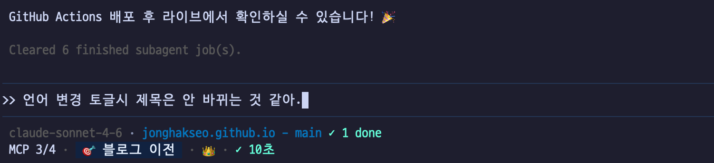
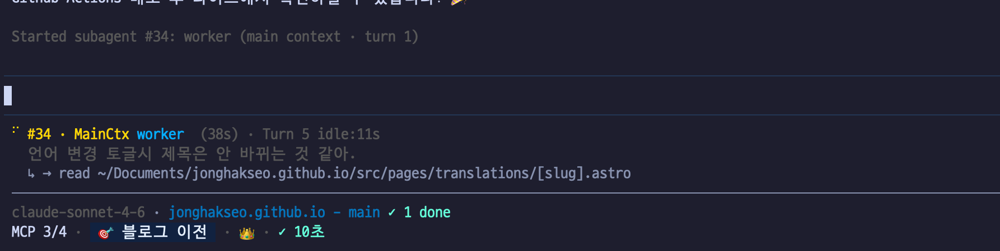
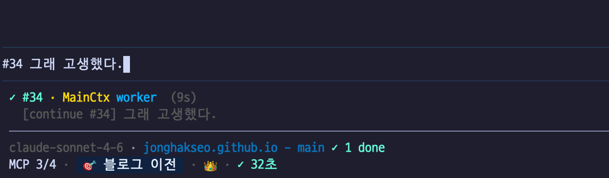
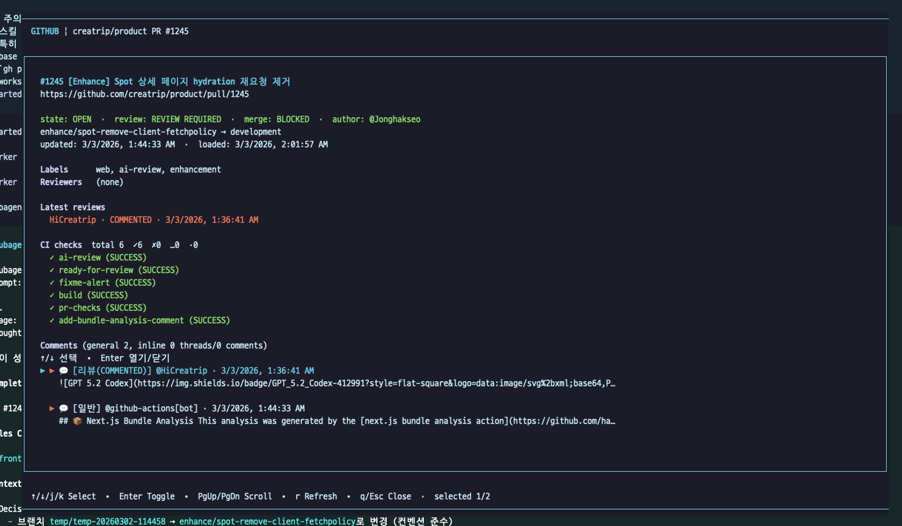
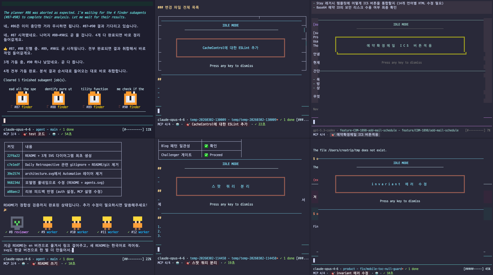
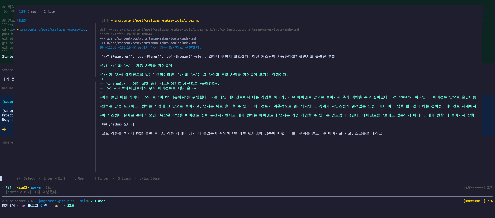

어제 쓴 회고 글 말미에서 pi agent를 잠깐 언급했는데, 쓰고 나서 이건 따로 글을 써야겠다는 생각이 들었다. 코딩 에이전트를 꽤 오래, 꽤 많이 써온 사람으로서 pi를 만나고 일주일간 겪은 일이 나름 의미 있는 경험이었던 것 같아서.

거두절미하고, 이건 코딩 에이전트 편력기이자 "내 도구"를 갖게 되기까지의 기록이다.

---

## 코딩 에이전트 헤비유저의 불만들

나는 Claude Code 버전 1.0 시기부터 Codex, Conductor, Amp, OpenCode, Oh-My-OpenCode까지 이름 있는 코딩 에이전트는 거의 다 써봤다. 팀 리드로서 코드를 직접 치는 시간보다 리뷰하고, 설계하고, 방향을 잡는 시간이 많아진 지금, 코딩 에이전트는 생산성의 핵심 축이다. (코드를 직접 안 쓰게 된지는 한두달 된 것 같다)

그런데 늘 어딘가 아쉬웠다. 잘 달리는 자동차인데 핸들이 불편하다거나, 엔진은 좋은데 시트가 안 맞는 느낌이랄까. 누군가가 만들어놓은 "좋은 도구"를 쓰면서도, 그게 "나의 도구"라는 감각은 없었다.

각각의 도구에서 느낀 것들을 정리해본다.

### Claude Code

좋은 자동차다. 잘 움직인다. 그런데 자율주행이라기보다 주행보조에 가깝다는 느낌이 계속 들었다. 핸들을 놓으면 안 되는 자동차.

가장 아쉬운 건 컨텍스트의 좁음이었다. 최근 1m이 부분적으로 열리긴 했지만, 체감상 아직도 200K를 넘어가면 지연시간이 크게 늘거나 성능이 떨어지는게 체감된다. 복잡한 작업을 하다 보면 에이전트가 알아야 할 맥락이 금세 넘치는데, 그 한계를 체감하는 순간이 너무 자주 왔다. 서브 에이전트도 있고, 에이전트 팀도 있고, 훅도 있고, 스킬도 있다. 기능적으로는 다 갖추고 있다. 그런데 서브 에이전트에 대한 제어가 명시적이지 않고, 내가 원하는 방식으로 오케스트레이션하기엔 늘 한 발짝 모자랐다.

다 있는데 아쉬움이 남는 그 감각. 도구를 탓하기엔 잘 만들어져 있고, 만족하기엔 내 손에 딱 맞지 않는.

### Codex

GPT 5.3 Codex의 지능과 작업 수행 능력은 솔직히 감탄스럽다. 자체 리뷰 기능도 강력하다. 모델의 힘으로 밀어붙일 수 있는 영역에서는 최고 수준이라고 느꼈다.

그런데 훅이 없다. 이게 사실 제일 치명적이다. 에이전트의 행동 전후에 내 로직을 끼워넣을 수 없다는 건, LLM의 비 결정적 동작과 정적 도구들의 결정적 동작을 보완할 수 없다는 말이다. 우리 팀에는 이미 hook 기반의 워크플로우 체계가 잡혀있기도 하고. 좋은 기성복인데 소매 길이를 못 줄이는 느낌이랄까. 모델 파워가 워낙 좋아서 함께 쓰긴 쓰는데, 메인으로 쓰기엔 아쉬운 부분이 계속 남았다.

### Gemini CLI

굳이 말 할 필요가 있나? 구글 직원들도 아마 안 쓸거다. 가끔씩 뭔가 해보지만 '그럼 그렇지'만 되뇌이며 Ctrl + C.

### Conductor

Claude Code와 Codex를 동일 GUI에서 실행할 수 있고, git worktree 기반 프로젝트 관리로 사용성이 좋다. GitHub 연동 등 편의 기능들도 계속 추가되는데 그렇게까지 필요한지는 모르겠고... 그래도 확실히 컨덕터 사용하고 생산성이 많이 늘었다.

하지만 구조적인 문제가 있었다. 세션별로 CC와 Codex 모델을 교체할 수 없다는 점, 그리고 CC를 headless로 동작시키는 게 기본값이라 매 턴마다 세션의 시작과 종료가 발생한다는 치명적인 문제. 사실상 훅 라이프사이클이 완전히 다르게 동작하는 셈이다. 게다가 쓰다 보면 무거워져서, 나중엔 렉이 너무 심해졌다. 나만 그런게 아니라 팀원들도 고통을 호소했다.

### OpenCode / Oh-My-OpenCode

OpenCode는... 안 이쁘다. 솔직히 개인적인 이유이긴 한데, 매일 보는 도구가 안 이쁘면 쓰기가 싫어진다. 나한테 불필요한 기능이 너무 많기도 했고.

Oh-My-OpenCode(OmO)는 에이전트 오케스트레이션에 대한 좋은 인사이트가 많은 프로젝트인 것 같다. 하지만 하네스가 너무 강했다. 도구의 프레임워크가 강력하다는 건, 뒤집어 말하면 내 업무 스타일을 도구에 맞춰야 한다는 뜻이다.

나는 그 반대를 원했다. 도구가 나한테 맞춰지는 것.

---

## pi를 만나다

[openClaw](https://github.com/openclaw/openclaw)의 사실상 본체가 pi라는 걸 알게 됐고, [아르민 로나허(Armin Ronacher)의 블로그 글](https://lucumr.pocoo.org/2026/1/31/pi/)을 읽고 가벼운 마음으로 찍먹을 해봤다.

pi의 README에 있는 Philosophy 섹션은 꽤 과감하다.

> **No MCP.** Extension으로 만들어라.
> **No sub-agents.** 직접 만들거나 패키지로 설치해라.
> **No permission popups.** 컨테이너에서 돌리거나, 직접 만들어라.
> **No plan mode.** 파일에 쓰거나, 직접 만들어라.
> **No built-in to-dos.** 모델을 혼란스럽게 한다. 직접 만들어라.

처음 읽으면 "이게 뭔 소리야, 다 없다고?" 하는 반응이 나올 수 있다. 나도 그랬던 것 같다.

그런데 이건 "No"가 아니라 YAGNI(You Ain't Gonna Need It)에 가깝다. 나한테 필요 없는 기능이 내 워크플로우를 방해하는 건 꽤 불쾌한 경험인데, pi는 그 불쾌함을 제거하는 대신 필요한 것을 직접 만들 수 있는 뼈대를 준다.

찍먹이 뷔페가 되기까지는 이틀도 안 걸렸다.

---

## 일주일간의 개조

pi를 쓰기 시작한 지 이제 일주일이 됐다. 그 일주일 동안 매일매일 pi 자체의 능력을 증강하고, 나한테 딱 맞는 핏으로 개조하는 데 시간을 할애했다. 다른 CLI나 도구는 더 이상 안 켰다.

일상적인 업무를 하다가 프로세스에서 탁탁 걸리는 부분을 발견하면, 그걸 바로 pi의 능력으로 내재화해서 효율화한다. 이 사이클이 짜릿하다.

불편함 발견 → 익스텐션 구현 → 즉시 적용 → 다시 업무.

이 루프가 정말 빠르게 돌아간다. 구현한 것들을 하나씩 소개해본다.

### mcp-bridge - 공식 지원을 안 하면 만든다

pi는 공식적으로 MCP를 지원하지 않는다. 제작자 Mario Zechner는 [MCP가 필요 없을 수도 있다는 글](https://mariozechner.at/posts/2025-11-02-what-if-you-dont-need-mcp/)까지 썼다.

하지만 나에겐 필요했다. 회고 글에서도 썼지만 나는 이미 사내 AI Platform에서 Jira, Slack, Google, Notion, Figma 등의 MCP 서버를 자체 구축해서 운영하고 있었고, 이걸 코딩 에이전트에서도 바로 쓸 수 있어야 했다. 그래서 `mcp-bridge`라는 이름의 익스텐션을 만들었다.

직접 만드니까 오히려 좋은 점이 있었다. MCP 서버와 에이전트 사이의 미들웨어 레벨에서 통제가 가능해졌다는 감각? 응답이 너무 길 때의 truncate 로직을 커스텀하거나, 특정 위험한 도구에만 권한 확인을 붙이거나, 어떤 도구 호출은 호출을 숨기거나 반대로 특정 조건에서는 막는 것도 가능하다. 공식 지원이었으면 이런 세밀한 제어는 어려웠을 것 같다.

### '>>' 컨텍스트 포크 - 제일 원하던 기능

Claude Code를 쓰면서 항상 이런 생각을 했다.

*"이 지점에서 이 맥락을 가진 새 에이전트를 바로 포크 떠서, 주제에서 살짝 벗어난 아이디어를 탐색해보고 싶다."*

pi에서 `>>` 라는 축약어로 구현했다.

```
>> 이 접근 방식 말고 다른 방법은 없을까?
>> 커밋해줘.
>>? 지금 이야기하는 거 html로 정리해서 열어줘
```

`>>`를 쓰면 현재 컨텍스트를 가진 새 에이전트가 바로 뜬다. 메인 에이전트의 컨텍스트를 더럽히지 않고, 주제에서 벗어난 창의적 아이디어를 조사하거나 검증할 수 있다. 반대로, 메인 에이전트를 나랑 언제든 대화할 수 있는 상태로 유지하면서 간단한 커밋이나 코드 작업을 위임할 때도 쓴다.

새 세션을 열 필요도 없고, 맥락을 다시 설명할 필요도 없다. 그냥 `>> 커밋해줘.` 한 줄이면 된다. 다른 어떤 도구에서도 이 방식으로는 불가능했던 것이고, 지금 제일 만족하면서 쓰고 있는 기능이다.

심지어 `>>` 뒤에 간단한 심볼을 정해놓고 실행할 서브 에이전트 선택을 극단적으로 간편화/개인화 했다.

`>>? (Resercher)`, `>># (Planer)`, `>>@ (Browser)` 등등... 얼마나 편한지 모르겠다. 이런 커스텀이 가능하다고? 하면서도 놀랐던 부분.


*`>>` 입력 한 줄로 현재 컨텍스트를 가진 새 에이전트를 포크한다*


*서브에이전트가 돌아가는 동안 메인 에이전트는 자유롭다*

### '<>' 와 '><' — 계층 사이를 자유롭게

`>>`가 "자식 에이전트를 낳는" 경험이라면, `<>`와 `><`는 그 자식과 부모 사이를 자유롭게 오가는 경험이다.

- `<> <runId>` — 이미 실행 중인 서브에이전트 세션으로 *들어간다*.
- `><` — 서브에이전트에서 부모 에이전트로 *올라온다*.

예를 들면 이런 식이다. `>>` 로 "이 PR 리뷰해줘"를 위임했다. 나는 메인 에이전트에서 다른 작업을 하다가, 리뷰 에이전트 안으로 들어가서 추가 맥락을 주고 싶어졌다. `<> <runId>` 하나면 그 에이전트 안으로 순간이동한다. 할 말 다 하고 나면 `><`로 다시 메인으로 돌아온다.

원하는 만큼 포크하고, 원하는 시점에 그 안으로 들어가고, 언제든 위로 올라올 수 있다. 에이전트가 계층적으로 관리되지만 그 경계가 자연스럽게 열려있는 느낌. 마치 여러 탭을 왔다갔다 하는 것처럼, 에이전트 세계에서 계층간 이동이 자유롭다.

이 시스템이 실제로 손에 익으면, 복잡한 작업을 에이전트 팀에 분산시키면서도 내가 원하는 에이전트에 언제든 직접 개입할 수 있다는 안도감이 생긴다. 에이전트를 "보내고 잊는" 게 아니라, 내가 원할 때 들어가서 방향을 잡아줄 수 있는 것.


*`<> <runId>`로 에이전트 안에 들어가, 할 말 하고 `><`로 다시 올라온다*

### /github 오버레이

코드 리뷰를 하거나 PR을 올린 후, AI 리뷰 상태나 CI가 다 돌았는지 확인하려면 매번 GitHub에 접속해야 했다. 브라우저를 열고, PR 페이지로 가고, 스크롤을 내리고...

귀찮았다. 그래서 `/github` 명령어를 만들었다. 오버레이로 바로 뜨게. 내가 원하는 PR 상태 — 리뷰 상태, CI 결과, 머지 가능 여부 — 를 터미널 안에서 바로 조회한다. 만들고 나니 창 전환이 사라졌다. 이게 별거 아닌 것 같은데 별거다.


*브라우저 없이 터미널에서 PR 상태, CI 결과, 리뷰까지 한눈에*

### 스크린 세이버

이건 좀 자랑하고 싶은 기능이다. TUI 기반이다 보니 터미널을 여러 개 띄워놓고 작업하면, 잠깐 자리를 비웠다 돌아왔을 때 각 터미널에서 뭘 하고 있었는지 알기가 어렵다.

스크린 세이버를 만들었다. 5분간 입력이 없으면 해당 세션의 주제나 레포/브랜치 정보를 화면에 띄운다. 돌아왔을 때 바로 맥락을 파악할 수 있다. 사소한 기능인데, 멀티 세션으로 작업할 때의 인지 부하가 확 줄어들었다.


*5분간 입력이 없으면 현재 작업 주제를 화면에 띄워준다. 여러 세션을 동시에 쓸 때 진가를 발휘한다*

### 그 외

- **Memory Layer** — `remember`, `recall`, `forget`으로 에이전트에게 장기 기억을 부여했다. 내 코딩 스타일, 프로젝트별 컨벤션, 기술적 결정사항 등을 기억시켜놓으면 매 세션마다 처음부터 설명할 필요가 없다. Claude Code 스타일.
- **to-html 스킬** — 대화 내용이나 조사 결과를 바로 격조 있는 HTML 문서로 변환. 추후 서술할 one-shot 프롬프트의 핵심이 된다.
- **Subagent 시스템** — 복잡한 작업을 여러 에이전트에 위임하고 병렬 처리. 회고 글에서 언급한 "one-shot 프롬프트 하나로 수십 개의 에이전트가 뚝딱거리면서 결과물을 내는" 그 구조.
- **files, todos 익스텐션** — 다른 사용자의 익스텐션 코드에서 가져와서, 내 입맛에 맞게 고쳐 쓰고 있다.


*직접 만든 내장 diff 뷰어. 서브에이전트가 수정한 파일을 터미널 안에서 바로 확인할 수 있다*

---

## "확장 가능하다"는 말의 의미

많은 도구들이 "확장 가능합니다"라고 말한다. 하지만 경험상 확장성에는 스펙트럼이 있다.

옵션을 바꿀 수 있는 수준(테마, 단축키), 정해진 인터페이스로 기능을 추가할 수 있는 수준(MCP 서버, VSCode 확장), 그리고 도구의 동작 자체를 재정의할 수 있는 수준.

pi의 Extension은 세 번째 수준에 해당한다. 단순히 기능을 "추가"하는 게 아니라 도구의 동작 자체를 바꿀 수 있다. 빌트인 도구를 교체할 수 있고, 에디터를 바꿀 수 있고, UI 위젯을 자유롭게 배치할 수 있고, compaction 로직을 재정의할 수 있다.

```typescript
export default function (pi: ExtensionAPI) {
  pi.registerTool({ name: "deploy", ... });
  pi.registerCommand("stats", { ... });
  pi.on("tool_call", async (event, ctx) => { ... });
}
```

TypeScript 하나로 도구, 명령어, 이벤트 핸들러, UI까지 전부 다룬다. `/reload` 한 번이면 수정이 바로 반영된다.

이게 왜 중요하냐면, 내가 불편을 느낀 순간부터 해결까지의 거리가 극도로 짧아지기 때문이다. GitHub 상태 확인하려고 브라우저를 열어야 해서 귀찮다? `/github` 오버레이를 만든다. 바로 쓴다. 멀티 터미널에서 맥락을 잃는다? 스크린 세이버를 만든다. 바로 쓴다. MCP가 필요하다? mcp-bridge를 만든다. 바로 쓴다.

이 "바로"가 핵심이다. 도구를 포크할 필요도, PR을 보낼 필요도, 다음 릴리즈를 기다릴 필요도 없다. 작년에 AI Platform을 만들면서 내가 원하는 워크플로우를 자동화할 때 느꼈던 짜릿함이, 이번에는 에이전트 도구 자체를 개조하면서 다시 찾아왔다.

---

## 아쉬운 점

솔직히 아쉬운 점도 있다. 생태계가 아직 작다.

나는 다른 사용자가 만든 `files`와 `todos`라는 익스텐션을 블로그 글에서 발견해서 가져다 쓰고 있다. 가져와서 바로 고쳐 내 입맛에 맞게 쓰는 것도 pi의 장점이지만, 이런 유용한 익스텐션들이 더 많이 공유되는 문화가 형성됐으면 하는 바람이 있다.

pi 패키지 시스템(`pi install npm:...`, `pi install git:...`)은 이미 잘 갖춰져 있다. npm이나 git을 통해 공유하고 관리할 수 있는 인프라는 준비되어 있는 셈이다. Discord 커뮤니티에서 익스텐션들이 하나둘 올라오고 있긴 한데, 이 흐름이 더 커졌으면 좋겠다. 오픈소스를 운영하면서 느낀 건데, 결국 생태계가 커지려면 누군가 먼저 공유를 시작해야 한다.

---

## 마치며

일주일이라는 짧은 시간이지만, pi와 보낸 시간은 그동안의 코딩 에이전트 편력에서 하나의 마침표 같다. 더 좋은 도구를 찾아 헤매는 게 아니라, 내 도구를 만들어가는 단계로 넘어온 느낌.

Claude Code의 안정감, Codex의 모델 파워, Conductor의 오케스트레이션 아이디어, OmO의 에이전트 설계 인사이트 — 다 의미 있는 경험이었다. 그리고 그 경험들이 있었기에, pi라는 빈 캔버스 위에 내가 정말 원하는 것을 그릴 수 있었던 것 같다.

이전 글에서도 썼지만, 나는 소프트웨어를 사용해서 어떤 문제든 푸는 걸 즐기는 사람이다. 아무리 AI가 다 해줘도, '다 해주는 AI들을 어떻게 묶어서 퀄리티를 극대화할 수 있을까'를 재미있게 고민하면서 할 사람이다. pi는 그 고민을 가장 직접적으로 할 수 있게 해주는 도구인 것 같다.

장인은 도구를 탓하지 않는다. 그런데 요즘 시대의 장인은, 한 발 더 나아가 도구를 만든다. pi는 그 "만들기"가 가장 쉬운 곳이다.
