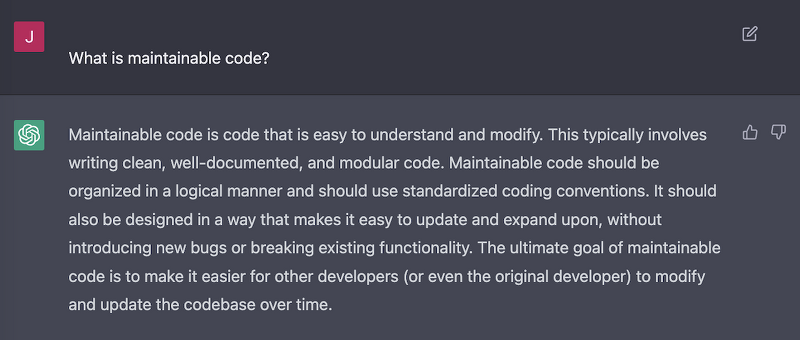
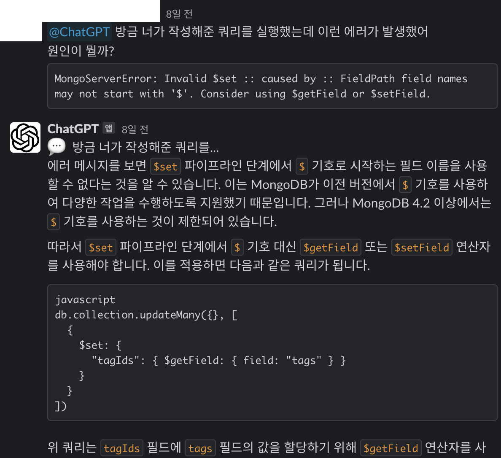
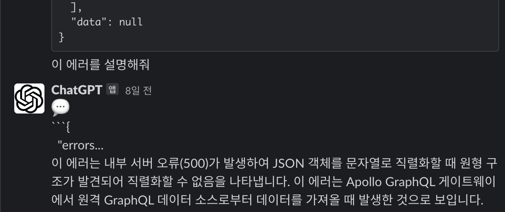
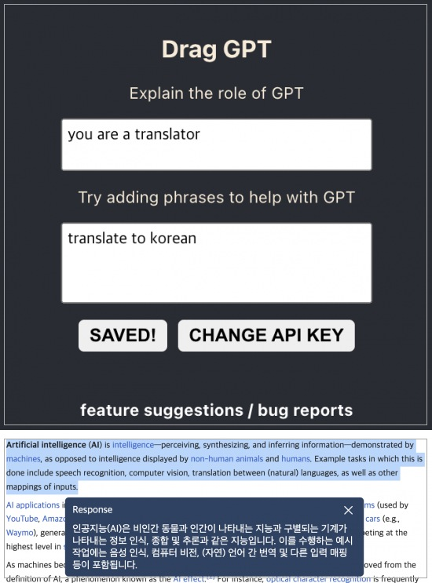
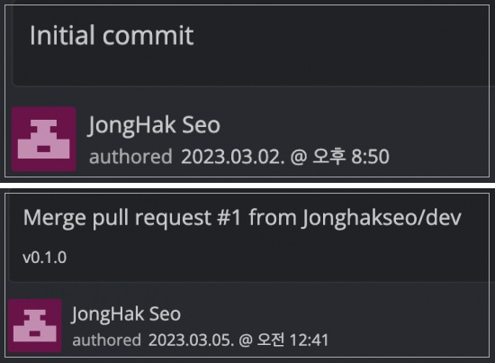
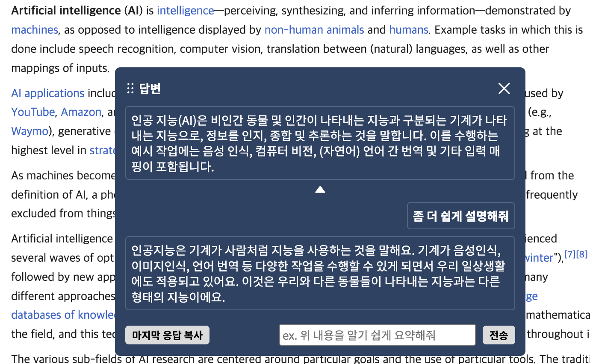
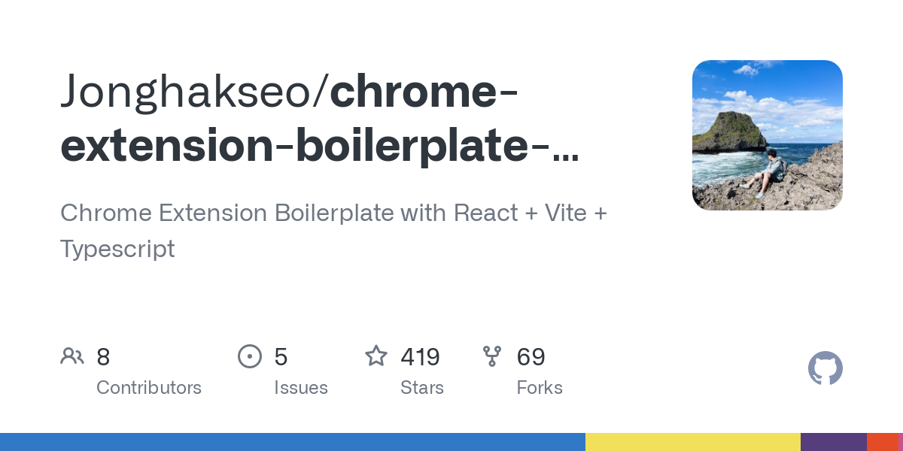
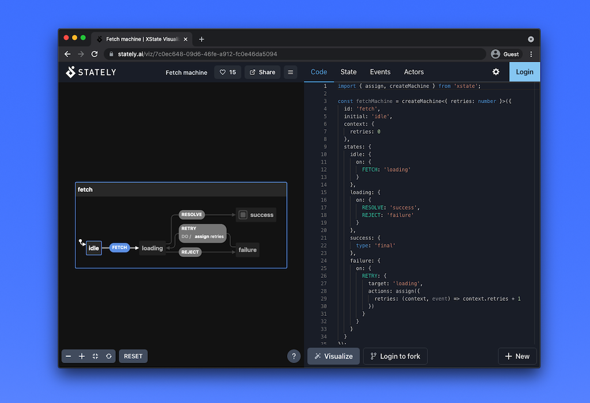
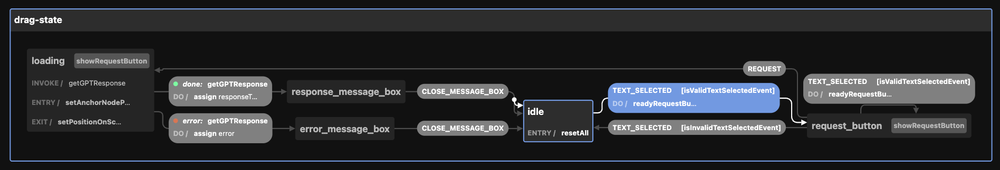

### 배경

최근 ChatGPT 열풍이 거세다. 연구 영역에 있던 생성 AI의 위치를 대중에 가깝게 옮기면서 대중들로 하여금 급격한 기술 발달이 이뤄지고 특이점이 왔다(?)는 생각을 하게 만드는 것 같다.

기존에 ChatGPT에게 회사 면접 질문을 몇 개 해봤다는 글도 올린 적이 있는데, ChatGPT의 이슈몰이와 함께 조회수가 꾸준히 올라가고 있다.

https://nookpi.tistory.com/156

개인적으로는 ChatGPT를 위시한 텍스트/이미지 생성 AI들의 사용 자체에 익숙하고 또 능숙해져야만 하는 시대가 오고 있다고 생각한다. 마치 2007년의 아이폰 공개, 2010년을 전후한 스마트폰 대중화와 같이 우리의 일상은 또다시 큰 변곡점을 만나게 될 것이다.

그런 맥락에서 회사 내 아직도 ChatGPT를 사용해본 경험이 없는 분들이 있다는 것이 아쉬웠다. 더 많은 팀원들이 AI리터러시가 중요해질 새 시대에 적응하길 바라는 마음이 있었다.

사내 슬랙에 ChatGPT 봇을 만들어서 배포한 이유도 그러한 마음에서였다. ChatGPT에 쓰이는 언어 모델에 요청하기 위한 api도 이미 공개가 되어있고, 호출 자체도 간단하기 때문에 후딱 만들어서 배포했다.

### 흥미

ChatGPT에게 역할을 부여하고, 해당 역할에 맞게 행동해 달라고 했을 때 답변의 퀄리티나 방향성이 완전히 달라진다는 이야기를 들었다. 실제로 테스트를 해보니 단순 '번역해 줘'라는 요청보다 '이제부터 번역가처럼 행동하고 주어지는 텍스트를 맥락에 맞게 번역해 줘'라는 프롬프트가 더 나은 결과를 반환한다는 것을 알았다.

요약 전문가(?)의 역할을 부여하고 BBC 등 영어 기사의 내용을 요약했을 때 결과의 퀄리티가 아주 좋았다. 나에겐 이런 특정 프롬프트가 정말 유용하다는 생각이 들었는데 다른 사람들은 각자 유용한 프롬프트가 있겠지? 하는 생각이 들었다.

좀 더 많은 사람들이 웹에서 쉽게 사용하기 위해서 크롬 익스텐션을 만들면 재밌겠다는 생각이 들어서 바로 착수했다.

다행히 나에겐 웹 익스텐션 개발을 위해 만들어둔 보일러 플레이트가 있었는데, 정작 보일러 플레이트는 만들어두고 아직까지 해당 보일러 플레이트를 활용해서 익스텐션을 만들어 게시하지 않았었다. 이번 기회에 보일러 플레이트도 한 번 제대로 써보고... 하는 마음도 있었다.

### 구상

컨셉 자체는 간단했다.

1. 사전에 어떤 요청을 할지 미리 정해둔다.
2. 텍스트를 드래그해서 요청하고 싶은 영역을 선택하고,
3. 마우스 근처에 있는 버튼을 눌러서 요청!
4. 결과는 바로 화면에서 확인

텍스트 선택 후 ChatGPT에게 사전 프롬프트 세팅에 따라 요청을 보내서 결과를 받는 POC를 만들었다.

직접 사용해 보니 뭔가 써먹을 수 있겠다는 확신이 들었다. 일단 나부터가 유용하게 쓰겠다는 생각이 들어 이후 며칠 동안 몇 가지 기능을 추가하였다.

1. 답변 결과에서 이어서 대화하는 기능 (ex. 답변을 한 줄로 요약해줘, 번역해 줘 등)
2. 사전 프롬프트 없이 빠른 대화
3. 프롬프트 생성 기능
4. 다국어 지원
5. 기타 편의기능

현재 크롬 익스텐션 웹스토어에 올려둔 상태이다.

피드백은 언제든 환영!

https://chrome.google.com/webstore/detail/%EB%93%9C%EB%9E%98%EA%B7%B8-gpt-%EB%93%9C%EB%9E%98%EA%B7%B8%EB%A1%9C-%EC%89%BD%EA%B2%8C-ai%EB%A5%BC-%EC%8B%9C%EC%9E%91%ED%95%B4%EB%B3%B4%EC%84%B8/akgdgnhlglhelinkmnmiakgccdkghjbh

### 개발 경험

#### Boilerplate

보일러플레이트를 세팅하고 ChatGPT 요청을 보내서 받는데까지 순식간에 끝났다. 버전 0.1.0이 나오는 데 4시간도 채 걸리지 않았으니 나름 빠르게 개발한 셈이다. 물론 빠르게 작성하면서 곳곳에 날림 코드가 있어 이후 리팩토링에 시간을 쏟았고 테스트 코드도 보강했다.

내가 만든 보일러플레이트라서 사용하기에 익숙한 부분도 있었고, 실제로 개발에 있어 불편함이 없게끔 많은 부분이 개선된, 나름 좋은 보일러플레이트라고 생각한다. hmr을 좀 야매로 구성해서 정말 큰 익스텐션을 만드는데 적합한지는 모르겠지만, 간단한 앱 정도 만드는 데에는 충분하다는 생각이 들었다.

요 레포도 벌써 Star 400개 Fork 60개가 넘었는데, 이슈를 남겨주시는 분들과 대신 답변 해주시는 분들에게 늘 감사하다.

https://github.com/Jonghakseo/chrome-extension-boilerplate-react-vite

#### XState

컨텐츠 스크립트 코드는 리액트로 구현되었는데, 상태에 따른 컨텍스트의 얽힘이 코드의 가독성을 매우 떨어뜨렸다. 코드 정리를 위해 어떤 패턴을 써볼까 고민하다가 이번 기회에 게임 개발에 많이 사용되는 유한상태기계(FSM) 패턴의 JS/TS 구현체인 XState를 사용했다. 결론부터 말하자면 굉장히 만족도가 높았다.

https://xstate.js.org/docs/

상태 간 이벤트를 통한 전이, 사용하기 편한 액션과 가드 덕분에 기존 코드가 깔끔하게 정리되었고, 유지보수에 대한 자신감도 가질 수 있었다.

이번 기회에 유한상태머신(FSM) 이론에 대한 관심도 생겨서, 사내 세미나 순서를 새치기해서 FSM 관련 세미나를 할 예정이다.

너무 딱딱한 이론보다는 사용 경험과 실제 코드에 접목했을 때의 관심사 분리에 대해 간단히 진행해보려고 한다.

#### 다국어 지원

크롬 익스텐션에서 다국어 지원은 처음 해봤는데, 다른 i18n 관련 라이브러리등의 지원 방식과 크게 다르지 않아 쉽게 적용할 수 있었다. 크롬에서 익스텐션의 다국어 기능을 내장하고 있어(chrome.i18n) 별도의 의존성 추가는 필요하지 않았고, 공식문서도 잘 나와있었다.

충격받았던 부분은 번역 그 자체였는데, 4개 국어(영어/중국어/일본어/한국어) 지원을 위해 영어로 작성한 i18n json 파일 내용을 그대로 긁어다가 ChatGPT에게 메시지만 번역해 달라고 하니 포맷 그대로 메시지만 번역해 줬다!

기존의 기계 번역이 하지 못하던 일을 너무도 쉽게 하는 모습을 보고 감명받았는데, 마찬가지로 html 내부의 텍스트도 딱 텍스트만 골라서 번역하는 모습을 보고 참... 여러 생각이 들었다.

### 앞으로의 계획

일단은 익스텐션 자체를 홍보하고 사용자를 늘리는 것을 목표로 하고 있다.

또한 현재는 프롬프트에 단순 텍스트를 넣어 지시문을 작성하고 있지만, 추후 고급 설정을 통해 temperature 등의 매개변수도 수정할 수 있게 만들 예정이다.

api 요청 자체가 큰 비용이 드는 게 아닌 만큼 라이트 유저를 위해 일정 요청은 무료로 가능하게 할지도 고민 중이다. 광고 배너 등의 수익화가 가능하다면 자체 서버를 띄우고 무료 요청이 가능하도록 할 수 있을 텐데 아쉽게도 크롬 익스텐션은 광고를 달 수 없다 ㅎㅎ
