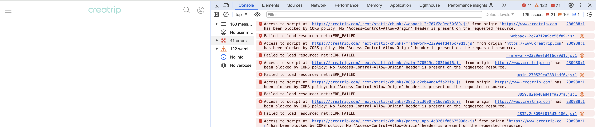
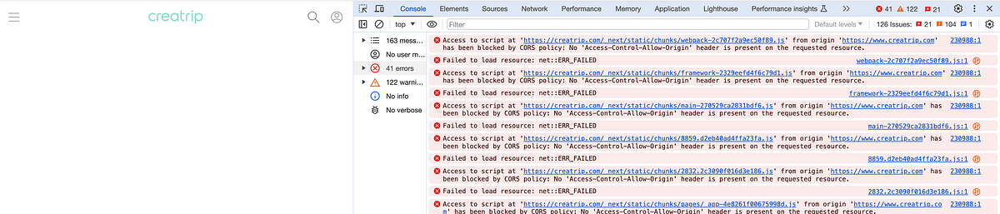

After today's scheduled deployment, a CORS error started occurring on JS chunk files requested from www.creatrip~.

It had been quite a while since I'd last seen a CORS error...!

At our company, static files generated from Next.js builds are served through S3 → CloudFront caching. No configuration changes had been made before or after the deployment.

As an immediate fix, we created a response header policy on the CDN for static files and added both the www and non-www domain origins to resolve the issue.

We addressed it quickly, but figuring out *why* this suddenly became a problem was quite challenging.

Initially, I wasn't even confident whether this issue started immediately after the deployment. It was also puzzling that SSG-generated static pages didn't have this issue.

The first difference I noticed was the presence of the `Origin` header—all resources experiencing CORS issues had an Origin value in their request headers.

While we were struggling to find the root cause, an excellent team member found the related issue and helped us understand the full story:

https://github.com/vercel/next.js/issues/34225#issuecomment-1804831899

Here's the summary:

1. The Next.js version before this deployment was 12.3.4.
2. In that version, CSR page script tags didn't have a `crossorigin` attribute.
3. Looking at the v12.3.4 code where [crossOrigin is declared](https://github.com/vercel/next.js/blob/v12.3.4/packages/next/build/webpack-config.ts#L982) and [where it's passed](https://github.com/vercel/next.js/blob/v12.3.4/packages/next/build/webpack-config.ts#L1986), when next.config's crossOrigin value is missing, `undefined` is passed as-is.
4. However, after the upgrade, [Next.js 13.5.6 inserts an empty string when next.config's crossOrigin is missing](https://github.com/vercel/next.js/blob/v13.5.6/packages/next/src/export/index.ts#L499)...!
5. This crossOrigin value is then used during script rendering. It was introduced as part of [this PR](https://github.com/vercel/next.js/pull/56311) to fix [this bug](https://github.com/vercel/next.js/issues/53190). As a result, when the config's crossOrigin value is absent, script tags generated by the `getRequiredScripts` logic always end up with a crossOrigin attribute—a bug(?) was born. (This bug was merged in [13.5.4-canary.10](https://github.com/vercel/next.js/releases/tag/v13.5.4-canary.10).)
6. The [crossOrigin attribute](https://developer.mozilla.org/en-US/docs/Web/HTML/Attributes/crossorigin) is used on certain dynamic scripts and enables CORS requests for element resource fetching.
7. When the crossorigin attribute is completely absent, no CORS request is made. But when it's an empty string, the default value `anonymous` is used, which sets the CORS request credentials flag to 'same-origin', triggering CORS requests.
8. In other words, it's a bug.

During a refactoring of the `renderOpt` property, an empty string was set as the default for crossOrigin. Then, in a subsequent bug fix, this crossOrigin value was used directly as a script tag attribute—creating the bug.

I thought this could be an opportunity to contribute to Next.js, but a [fix PR](https://github.com/vercel/next.js/pull/58200) had already been submitted last November.

Not sure why it hasn't been merged yet.

If you encounter a similar issue, try resolving it by adding a SimpleCORS or custom response header policy on your CDN that allows the origin for your domains.

---

This article was also published on Medium:

https://medium.com/creatrip/next-js-%EB%B2%84%EC%A0%84%EC%97%85-%EC%9D%B4%ED%9B%84-%EC%85%80%ED%94%84-%ED%98%B8%EC%8A%A4%ED%8C%85-%ED%99%98%EA%B2%BD%EC%97%90%EC%84%9C%EC%9D%98-cors-b7f7192bb9c4
