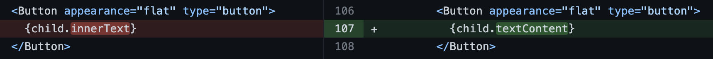
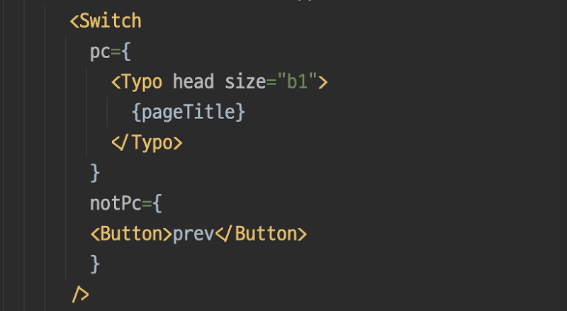
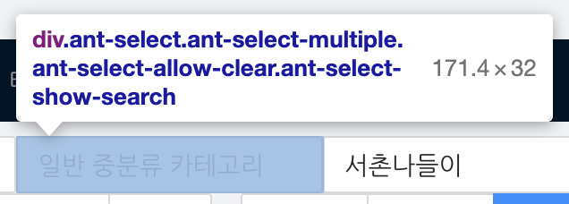
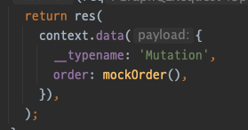
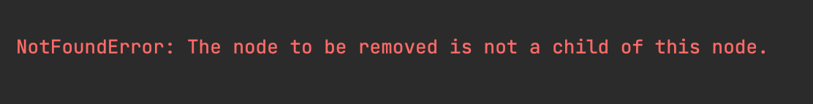
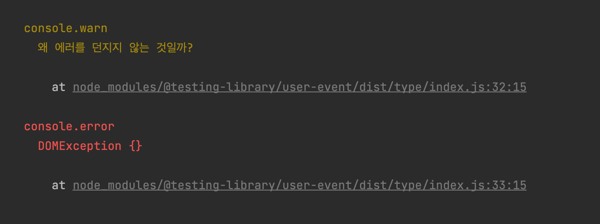
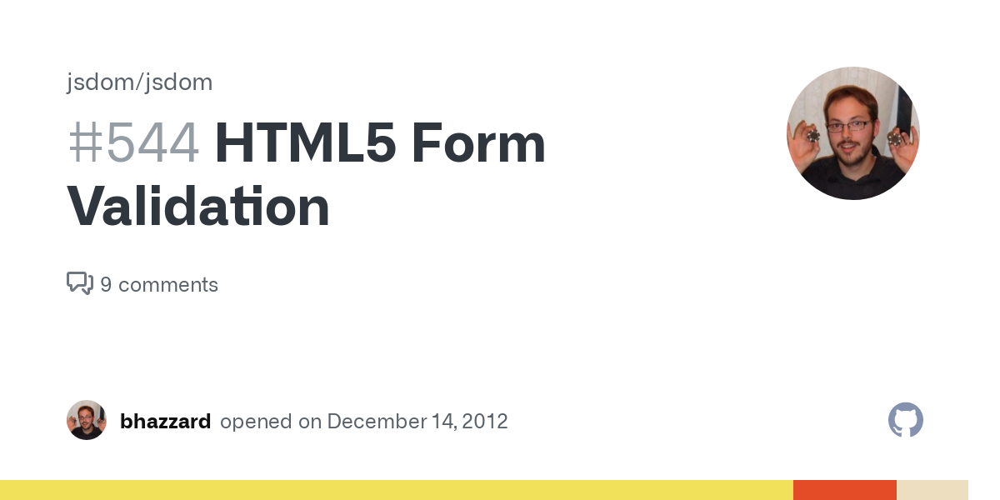
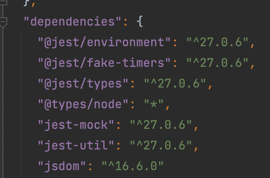
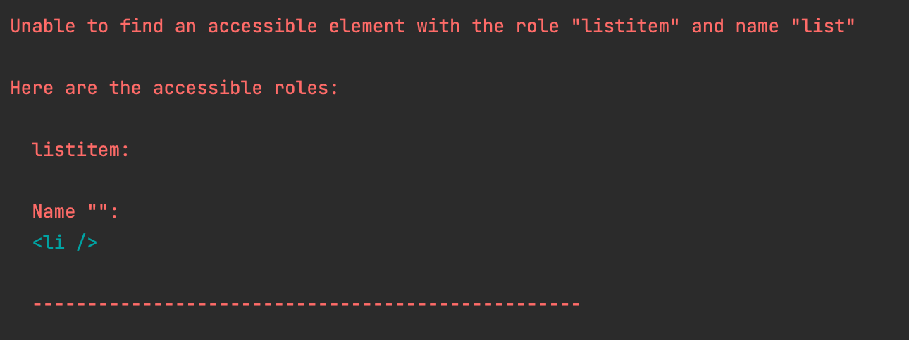
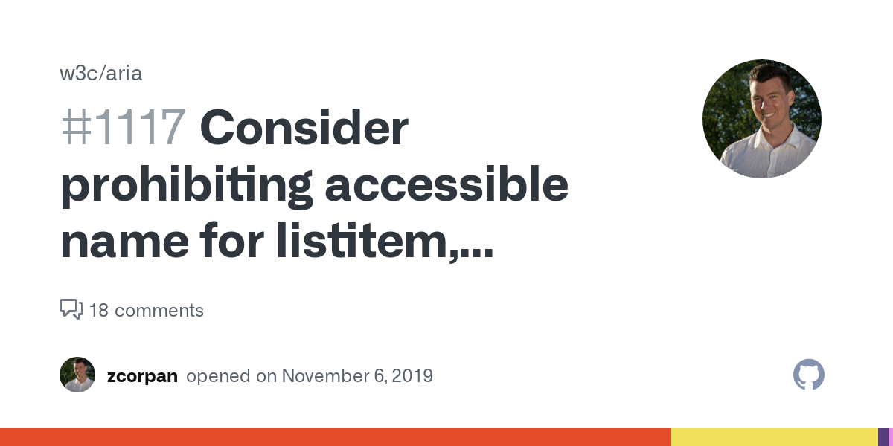

테스트 환경은 다음과 같습니다.
- jest (27.0.6 -> 28.1.3)
- jsdom (16.6.0 -> 19.0.0)
- @testing-library/react (12.0.0)
- @testing-library/user-event (13.5.0)



## 1. JSDOM 환경에서 innerText 감지 불가

Select 컴포넌트를 확장한 DropdownSelect 컴포넌트의 테스트를 하던 중, 선택된 값을 감지할 수 없는 이슈가 발생했습니다. (Select 컴포넌트는 여러 옵션 중 하나를 선택할 수 있도록 해주는 UI 컴포넌트로, Renderer 컴포넌트를 동적으로 받아 다양한 요구사항에 대응할 수 있는 컴포넌트입니다)

문제가 발생한 테스트는 DropdownSelect에서 특정 값을 선택하는 과정이 포함되어 있었는데, testing library의 **screen.debug** 메서드를 통해 살펴보니 선택한 값에 해당하는 텍스트가 보이지 않았습니다. 실제 브라우저 환경에서는 정상적으로 노출되고 있었음에도 말입니다.

문제 해결을 위해 여러 자료를 찾아본 결과 문제의 원인과 해결책을 특정할 수 있었습니다.

1. Select 컴포넌트 내부의 선택된 값을 보여주는 부분은 Select 컴포넌트 하위의 children에 있는 option element의 배열에서 가져오고 있었습니다.
2. option 요소에서 선택된 값을 가져오는 과정에서, **optionElement.innerText를** 사용하고 있었습니다.
3. innerText는 element의 text를 "as rendered". 즉, 렌더링 된 대로 가져오게 됩니다.
4. innerText에 대해 보다 자세히 알아보니, innerText는 실제로 해당 텍스트가 브라우저 환경에서 어떻게 보이는지에 따라 다른 값을 반환한다는 것을 알게 되었습니다.
5. innerText라는 값은 이미 스펙 자체가 "as rendered"인 값을 가져오기 때문에 레이아웃 엔진에 의존할 수밖에 없습니다.
6. 저희가 사용하는 테스트 환경은 jsdom이며, jsdom에는 레이아웃 엔진이 없습니다. 따라서 jsdom은 innerText를 지원하지 않습니다.

위와 같은 프로세스로 문제의 원인을 파악한 후, 저희 팀에서는 innerText를 대체하기 위해 textContent를 사용하기로 결정했습니다.

단순히 테스트가 깨지는 이유뿐 아니라, 실제 사용 목적으로도 html내에 들어간 텍스트를 그대로 줄 바꿈, 공백, 단락처리 등을 trim 하지 않고 반환하는 textContent가 더 적합하다고 판단했기 때문입니다.

> _And if all you need is to retrieve a text of an element without any kind of style awareness, you should — by all means — use textContent instead._

**참고 자료**

- https://html.spec.whatwg.org/multipage/dom.html#the-innertext-idl-attribute
- http://perfectionkills.com/the-poor-misunderstood-innerText/
- https://github.com/jsdom/jsdom/issues/1245

## 2. CI 환경에서만 실패하는 테스트


현재 저희 팀에서는 CI(지속적 통합)를 위해 Github Action을 사용하고 있습니다.

그런데 언젠가부터 CI 환경에서 일부 테스트가 실패하기 시작했습니다. 로컬에서는 아무리 돌려도 실패하지 않는 테스트들이 CI 환경에서만 실패하는 일이 반복되었습니다. 더군다나 일관된 실패가 아닌 간헐적 실패로, 테스트 action을 re-run 하면 바로 통과되는 바람에 디버깅 난이도가 수직 상승했습니다.

의심이 가는 부분에 대해 여러 시도를 해 보았습니다.

테스트 환경의 timzone(GMT)에 영향을 받는 구현이나 테스트 코드가 있는 게 아닌지 살펴보았고, 테스트 process가 병렬로 동작했을 때 발생하는 문제인지 확인하기 위해 로컬에서 최대한 테스트 환경과 비슷하게 테스트를 해보았습니다.

그러던 중, 간헐적으로 실패하는 테스트들의 공통점을 찾았습니다. 해당 테스트들이 실패하는 포인트는 모두 **await findBy~** 로 정해진 시간 내에 특정 요소를 찾지 못해 발생하는 부분이라는 점이었습니다.

결국 마지막으로 시도해 본 것은 테스트 환경의 timeout 자체를 늘리는 것이었습니다.

asyncUtilTimeout을 통해 react-testing-library에서 waitFor 혹은 find 메서드의 timeout을 기본 1초에서 4초로 늘려주었습니다.

https://testing-library.com/docs/dom-testing-library/api-configuration/#asyncutiltimeout

그 이후 간헐적 테스트 실패는 감쪽같이 사라졌습니다.

테스트를 하기 어렵게 만들어진 일부 레거시 컴포넌트의 경우, 통합 테스트를 위해 네트워크 모킹과 state의 변경을 통한 리렌더를 기다리는 waitFor/findBy를 사용한 부분이 있었습니다. 상대적으로 저사양인 테스트 환경에서는 이러한 복합적인 상태 변경과 리렌더링이 1초 내에 처리되지 않았던 모양입니다.

이 이슈의 경우 테스트 실패의 기준이 되는 timeout을 늘려 해결했지만, 근본적인 문제는 1초라는 긴 시간 동안 처리되지 않는 복잡한 로직과 불필요한 리렌더링이 발생하는 해당 컴포넌트 자체라는 생각이 들었습니다. 리팩토링을 통해 해당 컴포넌트의 코드 퀄리티를 올리고 테스트가 원활한 구조로 개선한다면 이런 일은 일어나지 않을 것으로 예상됩니다.

**참고 자료**

- https://testing-library.com/docs/dom-testing-library/api-configuration/#asyncutiltimeout

## 3. display:none으로 숨긴 요소가 jsdom에서 노출



이 이슈는 이미 다른 글로 다룬 적이 있어서, 해당 글의 링크로 대체합니다.

https://nookpi.tistory.com/139

## 4. antd 등의 UI 라이브러리를 사용하는 경우



antd와 같은 UI 라이브러리는 양날의 검입니다. 커스터마이징이 다소 어렵고 불필요한 인터페이스가 많지만, UI컴포넌트 작성에 들어가는 시간을 극단적으로 줄여준다는 점이 그렇습니다.

회사에서는 어드민 프로덕트에 antd를 사용하고 있는데, antd자체의 구현에 제약을 받는 부분보다 antd 사용으로 얻는 생산성의 향상이 더 크다는 판단 하에 어드민에서 제약적으로 사용하고 있습니다.

어드민 환경에서 테스트 코드를 작성하면서 일부 antd 컴포넌트가 react-testing-library를 통해 테스트하기 어려운 구조로 되어 있다는 사실을 알게 되었습니다. 예를 들어, antd의 select 컴포넌트는 일견 input처럼 보이지만 div로 구현되어 있습니다.


그리고 select 컴포넌트의 placeholder는 span tag로 구현되어 있었습니다. 때문에 placeholder를 기반으로 요소를 찾기 위한 **ByPlaceholder** 쿼리 셀렉터를 전혀 사용할 수 없었습니다.

이런 경우에는, 커스텀 쿼리 셀렉터를 만들어주는 방법으로 해당 컴포넌트를 쿼리 할 수 있습니다.

https://testing-library.com/docs/react-testing-library/setup/#add-custom-queries

```typescript
import { buildQueries } from '@testing-library/react';

const ANTD_SELECT_PLACEHOLDER_CLASS_NAME = 'ant-select-selection-placeholder' as const;

const queryAllByAntdSelectPlaceholder = (container: HTMLElement, placeholder: string): HTMLElement[] => {
  const selectPlaceHolders = container.getElementsByClassName(ANTD_SELECT_PLACEHOLDER_CLASS_NAME);
  return Array.from(selectPlaceHolders).filter(
    selectPlaceHolder => selectPlaceHolder.textContent === placeholder,
  ) as HTMLElement[];
};
const getMultipleError = (container: Element | null, placeHolder: string) => `Found multiple elements: ${placeHolder}`;
const getMissingError = (container: Element | null, placeHolder: string) => `Unable to find an element: ${placeHolder}`;

const [
  queryByAntdSelectPlaceholder,
  getAllByAntdSelectPlaceholder,
  getByAntdSelectPlaceholder,
  findAllByAntdSelectPlaceholder,
  findByAntdSelectPlaceholder,
] = buildQueries(queryAllByAntdSelectPlaceholder, getMultipleError, getMissingError);
```

antd의 select 컴포넌트를 placeholder 값으로 가져올 수 있는 **ByAntdSelectPlaceholder**를 만들었습니다.

그러나 antd 환경에 완벽하게 의존적인 커스텀 쿼리 셀렉터를 일일이 만들고 이를 사용해서 테스트를 하는 것이 과연 적합한지에 대한 의문이 들었습니다. 저희 팀 내부에서는 커스텀 쿼리 셀렉터를 만드는 데 드는 시간과 유지보수 비용, 그리고 어드민 환경에서의 테스트 코드에 대한 효용이 작성 비용을 넘어설지에 대한 고민 끝에, 어드민 프로덕트에서는 antd 세부 구현에 의존하지 않는 제한적인 테스트 코드를 작성하기로 결정했습니다.

커스텀 쿼리 셀렉터를 작성함으로써 테스트 효용이 높아지는지, 유지보수 비용과 테스트 효용을 잘 계산해 각 팀이 처한 상황과 목적에 따라 현명한 결정을 하는 게 좋을 것 같습니다.

**참고 자료**

- https://testing-library.com/docs/react-testing-library/setup/#add-custom-queries

## 5. graphql 응답 mocking시 id와 typename을 일일이 붙여줘야 하는 이슈

이 이슈도 아주 간편하게 문제를 해결해 주는 라이브러리가 있어 해당 글의 링크로 대체합니다.

한 가지 아쉬운 점은 fragment와 query에 대한 mocking이 아직 지원되지 않는다는 점...?

https://nookpi.tistory.com/134

## 6. 테스트 환경에서 삭제한 노드를 reconciliation 할 경우 발생하는 에러



3번 이슈에서 다뤘던 **removeOtherMediaQueryDisplay**를 사용하면서 발생한 이슈입니다.

render 메서드에 포함된 **removeOtherMediaQueryDisplay**가 호출되거나 혹은 직접 **element.remove**를 호출해 해당 element를 삭제하는 경우, state 변경등을 통해 해당 element를 다시 렌더링 하면 에러가 발생합니다.

```tsx
test('에러 발생 테스트', () => {
  // given
  const Usage = () => {
    const [visible, setVisible] = useState(true);
    return (
      <>
        <input onChange={() => setVisible(false)} />
        {visible && <div id="removed-element" />}
      </>
    );
  };
  // when
  render(<Usage />);

  // 렌더링 이후 조건부 렌더링 되는 요소를 삭제하는 경우
  document.body.querySelector('#removed-element')?.remove();

  // then
  const input = screen.getByRole('textbox');
  // NotFoundError: The node to be removed is not a child of this node.
  fireEvent.change(input, { target: { value: '1' } });
  // or
  userEvent.type(input, '1'); 
  // userEvent의 경우 fireEvent와 달리 에러가 console.error로만 노출되고 throw되지 않아 주의가 필요하다.
});
```

에러의 원인은 vdom에서 알 수 없는 dom의 변경사항을 일으키는 경우 리액트의 재조정(reconciliation) 과정에서 해당 노드를 찾을 수 없기 때문입니다. 쉽게 말해, 메모리에 적재된 vdom의 구조와 실제 dom의 불일치에서 오는 에러입니다.

근본적인 해결 방법은 저런 상황을 만들지 않는 것입니다. dom의 직접적인 조작이 권장되지 않는 방법일뿐더러, vdom과 실제 dom의 불일치를 일으키는 코드는 좋은 코드가 아니기 때문입니다.

하지만 저희가 사용하는 **removeOtherMediaQueryDisplay** 메서드처럼 불가피하게 이런 상황이 생긴다면 어떻게 해야 할까요?

우회 방법은 간단합니다. 위 에러는 삭제하는 노드와 조건부 렌더링의 대상이 되는 노드가 일치하지 않으면 발생하지 않습니다. 즉, 예제 코드에서는 removed-element를 다른 reactNode로 한 번 감싸면 해결이 됩니다.

또한 **userEvent의 경우** 일부 이벤트(type 등)에서 해당 에러를 throw 하지 않고 console.error 처리를 하는 바람에 테스트가 실패하지 않아 **해당 이슈가 발생했다는 사실을 인지하기 어려우니 각별히 주의가 필요**합니다.





## 7. jsdom 버그로 인해 테스트 환경에서 form invalid event 감지가 안 되는 현상



어느 날, 일부 폼 컴포넌트 테스트에서 버그가 발견되었습니다. 해당 컴포넌트는 모든 비즈니스 요구사항에 대한 테스트 코드가 작성되어 있었고, 모든 테스트를 통과한 상태였습니다. 놀랍게도 테스트 코드를 자세히 살펴보니 실패해야 하는 테스트 코드가 성공하고 있었습니다.

위 양성(positive false) 테스트로 인해 테스트 코드에서 문제를 충분히 발견하지 못하고 프로덕션에 배포되어 고객들에게 좋지 않은 경험을 제공한 것입니다.

통과되면 안 되는 테스트 코드의 예시는 다음과 같습니다.

```tsx
test('통과되면 안 되는 테스트' , () => {
     // given
      const onSubmit = jest.fn();
      const onInvalid = jest.fn();

      // when
      render(
        <form onSubmit={onSubmit} onInvalid={onInvalid}>
          <Input required validate />
          <input required />
          <RequiredFieldValidator hasValue={false} message="error" />
          <button />
        </form>,
      );

      userEvent.click(screen.getByRole('button'));

      // then
      expect(onSubmit).toBeCalled();
      expect(onInvalid).not.toBeCalled();
});
```

실패해야 하는 이 테스트 코드가 실패하지 않는 이유는, jsdom에서 브라우저의 form validation을 동작시키지 못하기 때문입니다. 테스트 환경에서 폼의 invalid event를 감지하기 위해서 onSubmit 메서드 내부에서 직접 **event.reportValidity**를 호출해줘야 했습니다.

찾아보니 이미 이 부분에 대한 이슈 제기가 있었습니다.

https://github.com/jsdom/jsdom/issues/544

그리고 해당 이슈는 이미 수정되어 jsdom 18.0.0에서 릴리즈 된 상황이었습니다.

https://github.com/jsdom/jsdom/commit/6a4d9a0646dc19b9521066251d8338953f0715a6

https://github.com/jsdom/jsdom/releases/tag/18.0.0

당시 저희가 사용 중이던 jsdom은 jest 27.0.6에 의존하고 있으며, 해당 버전의 jest는 jsdom 16.6.0을 사용하고 있었습니다.

jsdom 18.0.0 이상을 사용하는 jest 버전을 찾아보니 28.0.0 alpha 버전부터 의존하는 jsdom이 16.6.0 -> 19.0.0으로 올라갔다는 사실을 알 수 있었습니다. 일단 임시 조치로 onSubmit 메서드 내부에서 **reportValidity**를 호출하도록 해 두었고, 이른 시일 내에 jest 버전을 28 이상으로 올려 해당 이슈를 해결하였습니다.

만약 모종의 이유로 jest 버전을 올리기 쉽지 않은 환경이라면, 임시 조치로 **reportValidity**를 사용하는 것을 고려해 보시길 바랍니다.

비록 jest 버전을 올리기 전의 임시 조치라지만, 잠시나마 구현 코드가 테스트 코드(특히 테스트 환경)에 의존성을 가지는 당혹스러운 상황이 발생한 셈입니다.

**참고 자료**

- https://github.com/jsdom/jsdom/issues/544

## 8. Next/Image 컴포넌트의 lazyload로 인해 테스트 코드 내부에서 src 감지 불가



저희 회사의 웹 프로덕트에는 Next/Image 컴포넌트가 사용되고 있습니다.

해당 컴포넌트는 내부적으로 이미지 최적화를 위한 여러 기능을 내장하고 있는데, 대표적인 기능이 바로 지연 로딩(lazyloading)입니다.

Next 13부터는 브라우저의 네이티브 lazyload를 지원하지만, 이전 버전까지는 IntersectionObserver를 활용해 지연로딩을 구현하고 있습니다. 웹 프로덕트에서 아직 Next 12 버전을 사용하고 있어, Image 컴포넌트 역시 IntersectionObserver로 구현된 지연 로딩을 사용하는 레거시 Next/Image 컴포넌트를 사용하고 있습니다.

IntersectionObserver를 통한 지연 로딩의 구현은 통상적으로 img 내부에 해당 이미지의 소스를 동적으로 삽입하는 형태로 구현이 되기 마련입니다. 기존 Next/Image 컴포넌트의 소스 코드를 보면 그러한 부분이 잘 나타나 있습니다.

- https://github.com/vercel/next.js/blob/v12.3.3/packages/next/client/image.tsx#L925
- https://github.com/vercel/next.js/blob/v12.3.3/packages/next/client/image.tsx#L1051

위 코드에서 img 태그의 초기 src를 투명 svg로 채워 넣는 동작을 확인할 수 있는데, 이 부분이 테스트 코드에서 이슈가 되었습니다.

저희 팀에서는 일부 테스트 코드에서 이미지가 제대로 노출되는지, 원하는 이미지가 노출되는지 확인하기 위해 src attribute를 확인하고 있었습니다. 그러나 위의 세부 구현 이슈로 인해 초기 이미지 컴포넌트의 src 값이 투명 svg 값으로 세팅되면서 올바른 src가 반영되었는지 알 수 없었습니다.

때문에 다음과 같이 waitFor을 사용하여 감싸주는 처리를 해야 했습니다.

```typescript
await waitFor(() => {
  expect(thumbnail.getAttribute('src')).toContain(mockData.ImageUrl);
});
```

함께 고려했던 다른 해결방안들은 다음과 같습니다.

1. Image 컴포넌트 내부에서 test 환경에 따라 lazyloading disable 처리 → 테스트 환경에 의존적인 구현 환경의 분기 코드가 추가되는 상황
2. lazyload 여부와 관계없이 src를 확인할 수 있도록 하는 별도의 이미지 테스트 유틸함수 생성 → 테스트 코드의 복잡성 증가, 테스트 코드 내 불필요한 추상화 레이어 생성에 대한 경계
3. 브라우저 네이티브 lazyload를 사용하는 Next13의 Next/Image로 업그레이드 → 당장 할 수 있는 방법이 아님. 충분히 검토 후 점진적 마이그레이션 필요

궁극적으로는 3번으로 해결을 하는 게 맞다고 생각합니다. 저희 팀에서는 현재 이미지 렌더링에 대한 테스트 케이스 자체가 적어 임시로 waitFor/findBy~를 통한 비동기 지연 검증을 사용하고 있습니다.

**참고 자료**

- https://web.dev/browser-level-image-lazy-loading/
- https://github.com/vercel/next.js/blob/canary/packages/next/src/client/image.tsx
- https://nextjs.org/docs/api-reference/next/image

## 9. byRole 메서드는 어떻게 사용해야 할까?



React Testing Library에는 테스트를 용이하게 하게끔 도와주는 여러 쿼리 셀렉터가 있습니다.

저희 팀에서는 그중에서도 byRole 쿼리를 가장 자주 사용하고 있는데, byRole 쿼리는 RTL에서 가장 우선해서 사용하길 권장하는 쿼리 방식으로 접근성 트리를 기반으로 동작합니다. 또한, 접근성을 고려한 시멘틱 태그를 바탕으로 웹을 구축했다면 byRole을 통해 얻을 수 없는 요소는 굉장히 적을 것이라고도 말하고 있습니다.

https://testing-library.com/docs/queries/about/#priority

byRole은 주로 아래와 같이 사용하게 됩니다.

```typescript
getByRole('button', {name: "제출" });
```

한 컴포넌트 내부의 여러 button이 존재할 수 있기 때문에, 테스트하려는 버튼을 특정하기 위해서 저희는 두 번째 인자의 name property로 버튼에 실제로 노출되는 텍스트인 "제출"을 넘겨 해당 버튼을 특정하게 됩니다.

이처럼 byRole과 name은 함께 자주 사용됩니다.

앞서 말씀드렸다시피 byRole 쿼리는 접근성 트리를 기반으로 동작하고 name은 접근성 트리의 접근 가능한 이름(accessible name)을 가리킵니다. 접근성 트리는 (당연하게도) 사용자가 실제로 접근할 수 없는 요소들에 대해서 제외하고 있습니다.

접근성 트리에서 제외되는 조건들은 다음과 같습니다.

1. 상위 Element 혹은 Element 자체에 다음과 같은 css가 있을 때 (display:none, visibility:hidden)
2. Element에 role="presentation" or role="none"을 명시적으로 선언하여 Element의 암시적인 시멘틱을 제거할 때
3. Element에 aria-hidden="true" 선언 (부모 요소의 hidden:true가 자식 요소의 hidden:false보다 우선)

그럼 이제 byRole에서 자주 사용되는 접근 가능한 이름이 어떻게 계산되는지 살펴보도록 하겠습니다.

https://www.w3.org/TR/accname-1.1/#mapping_additional_nd_te

특정 요소에 대한 accessible name을 구하는 방법은 대략적으로 다음과 같습니다.

- name을 구하기 위해 해당 요소뿐만 아니라 다른 참조 노드 혹은 자식 노드도 순회하면서 텍스트를 누적하게 됩니다.
- 순회하는 노드가 숨겨져 있거나 aria-label 혹은 aria-labelledby 등의 참조 attribute가 특별히 없는 경우 빈 문자열을 반환합니다.
- 유효한 aria-label이 있는 경우 aria-label 내의 값을 계산합니다.
- native tag에 alt text를 정의하는 attribute에 값이 있을 경우 해당 값을 계산합니다.
- role="button"의 경우 버튼 내부의 값을 계산합니다.

다만 위 규칙을 대략적으로 숙지한 상태에서도 테스트를 하다 보면 접근 가능한 이름의 계산이 생각한 대로 이뤄지지 않는 경우가 종종 발생하는데, 대표적으로는 role="listitem"을 사용하는 **\<li\>** 태그가 있습니다.

```tsx
// when
render(<li>list</li>);

// then
screen.getByRole('listitem', { name: 'list' });
```

이와 관련된 이슈를 찾으면 다음과 같은 문서를 찾을 수 있습니다.

https://github.com/w3c/aria/issues/1117

요약하자면 APG(Aria Authoring Practices Working Group)에서 listitem, rowgroup, term, time 4가지 role에 대해서는 접근 가능한 이름 계산을 하지 않겠다는 이야기입니다.

왜 위의 role에 대해서는 이름 계산을 지원하지 않을까요? listitem만 살펴보면 paragraph와 같이 그 자체로 이름을 가져야 하는 요소가 아니라고 판단했기 때문입니다.

처음 테스트를 하면서 listitem이 접근 가능한 이름을 계산해주지 않아 다소 불편함을 느꼈는데, 그 이유를 알아보니 충분히 납득할 수 있었습니다.

**참고 자료 & 접근성 관련 읽으면 좋을만한 글**

- https://testing-library.com/docs/queries/about/#priority
- https://testing-library.com/docs/queries/byrole
- https://www.w3.org/TR/wai-aria-1.2/#tree_exclusion
- https://www.w3.org/TR/accname-1.1
- https://github.com/w3c/aria/issues/1117

## 10. fireEvent에서 userEvent로 마이그레이션 이후 테스트가 깨진다면



저희 팀에서는 테스트 코드를 도입하고 한동안(약 1~2개월) 이벤트 트리거로 fireEvent를 사용했습니다.

팀원 각각이 테스트 코드에 보다 익숙해지면서 보다 사용자 중심의 이벤트 트리거를 사용하기 위해 RTL 에코 시스템중 하나인 userEvent를 도입하였습니다. 그런데 fireEvent 메서드를 userEvent로 바꾸기 시작하면서 일부 테스트 코드에서 통과하던 테스트가 실패하는 경우가 생겼습니다.

해당 이슈를 면밀히 살펴본 결과, 실패하는 테스트 코드들에 다음과 같은 공통점이 있음을 알 수 있었습니다.

- label로 감싸진 input 컴포넌트가 있다
- input 컴포넌트에는 형제 element가 있다
- 형제 element는 input 컴포넌트와 마찬가지로 컨트롤 가능한 요소이다 (select, 혹은 다른 input)

원인 분석을 위해 userEvent 소스 코드를 열어보는 방법으로 동작을 파악해 나갔습니다. 직접 살펴본 userEvent의 type의 처리 흐름은 다음과 같았습니다.

1. 타이핑을 하려는 element가 disable 상태가 아닌지 확인
2. element 클릭
3. element에서 가장 가까운 label을 찾고, label이 있다면 해당 label의 control element를 찾아 **focus** 호출
4. 포커싱 된 control element의 ownerDocument에 접근해 ownerDocument의 activeElement를 가져옴
5. 타이핑 이벤트(keydown, keypress, keyup)를 fireEvent를 통해 트리거

문제가 발생한 부분은 바로 3번이었습니다.

label의 컨트롤 요소를 찾는 과정에서, label 안에 두 가지 이상의 컨트롤 요소(select-국가코드, input-전화번호)가 들어있는 경우, 앞에 위치한 select 요소가 focus가 되어버리는 것이었습니다.

그런데 사실 하나의 label 안에 2가지 이상의 상호작용 가능한 요소를 배치하는 것은 접근성 관점에서 권장되지 않는 방법입니다.

https://html.spec.whatwg.org/multipage/forms.html#labeled-control

이를 계기로 하나의 label에 두 개 이상의 컨트롤 요소를 넣는 기존 구현이 문제라는 사실을 인지할 수 있었고, 이후 보다 접근성을 고려한 입력 필드 컴포넌트 구현을 할 수 있게 되었습니다.

**주의**
userEvent 라이브러리는 14.0부터 굉장히 많은 breaking change를 가지고 있습니다. 특히 14.0부터는 모든 userEvent가 Promise를 반환하며 react의 상태 업데이트를 기다릴 수 있게 됩니다.

- https://github.com/testing-library/user-event/issues/504

또한 14.3 이후 버전에서 userEvent.click이 form을 제출하지 않는 버그도 있으니 사전에 꼼꼼히 살피고 적용하시길 권합니다.

- https://github.com/testing-library/user-event/issues/1075

**참고자료**

- https://testing-library.com/docs/user-event/intro
- https://github.com/testing-library/user-event/issues/504
- https://html.spec.whatwg.org/multipage/forms.html#labeled-control
- https://developer.mozilla.org/en-US/docs/Web/HTML/Element/label
- https://developer.mozilla.org/en-US/docs/Web/API/Node/ownerDocument
- https://developer.mozilla.org/en-US/docs/Web/API/Document/activeElement

---

그 밖의 테스트 코드 작성과 관련해서 읽으면 좋은 글을 공유합니다.

- https://overreacted.io/the-wet-codebase/
- https://kentcdodds.com/blog/avoid-nesting-when-youre-testing
- https://kentcdodds.com/blog/aha-testing
- https://kentcdodds.com/blog/testing-implementation-details

개인적으로는 테스트 코드를 작성하는 것 자체에 큰 의미를 부여할 필요는 없다고 생각합니다. 팀, 혹은 개인이 테스트 코드를 통해 하고자 하는 것이 무엇인지, 어디부터 어디까지 테스트를 하는 것이 한정된 자원에서 가장 큰 효용을 낼 수 있는지, 각자의 상황에서 충분한 고민이 선행되어야 한다고 생각합니다.

테스트 코드를 꾸준히 작성하면서 얻은 효용이 굉장히 많지만, 그중 가장 큰 부분은 "테스트가 쉽게 가능한 설계"에 대해 고민하는 과정에서 저를 포함한 팀원들의 설계 역량이 비약적으로 향상되었다는 점입니다.

비록 이 글에서는 다루지 않았지만, 테스트 코드를 꾸준히 작성해 나가면서 잘못 설계된 구현체의 테스트 코드 작성이 쉬울 수는 있지만 **제대로 설계된 구현체의 테스트 코드 작성이 어려울 수는 없다**는 것을 깨달았습니다.

지난 1년간 테스트 코드를 작성하면서 겪은 (그나마 생각하기에) 큼직큼직한 이슈들을 정리해 두었습니다. 위 내용이 테스트 코드 도입에 고민 중이신 분들, 혹은 테스트 코드를 작성하기 시작한 지 얼마 되지 않은 분들에게 조금이나마 도움이 되었으면 좋겠습니다.
