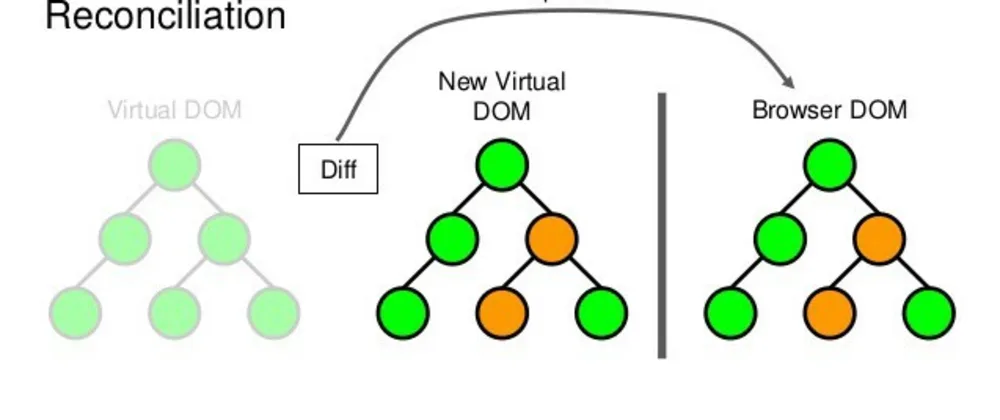
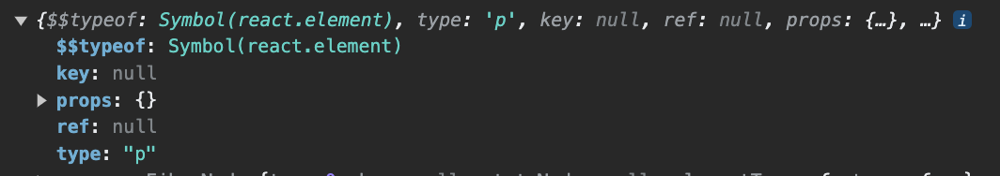
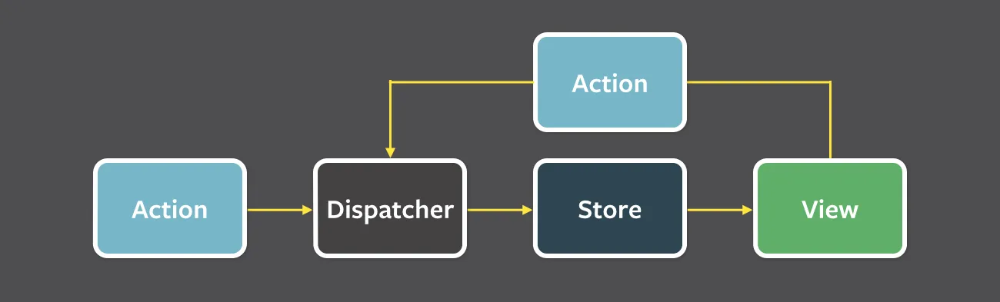
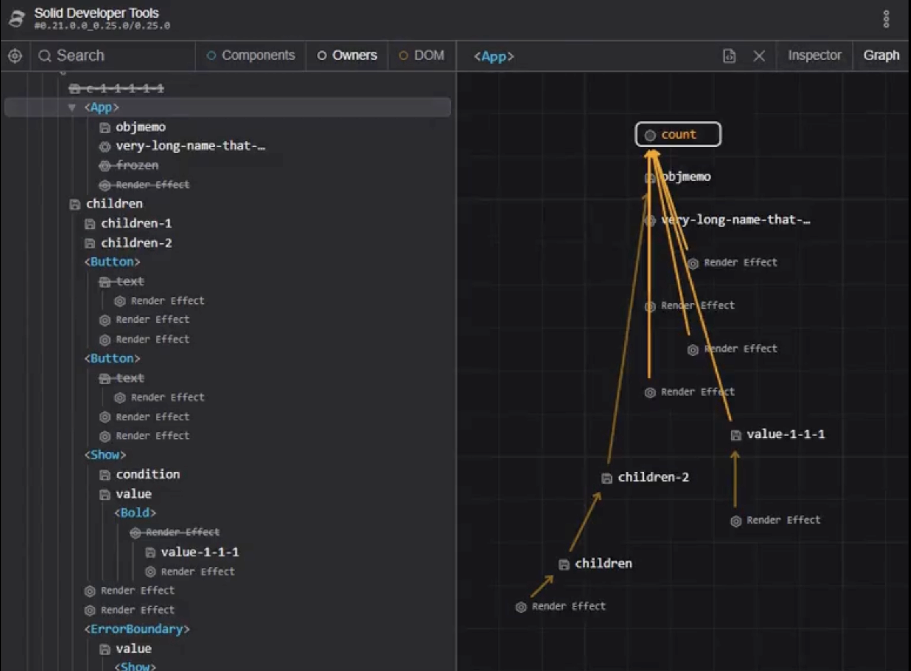
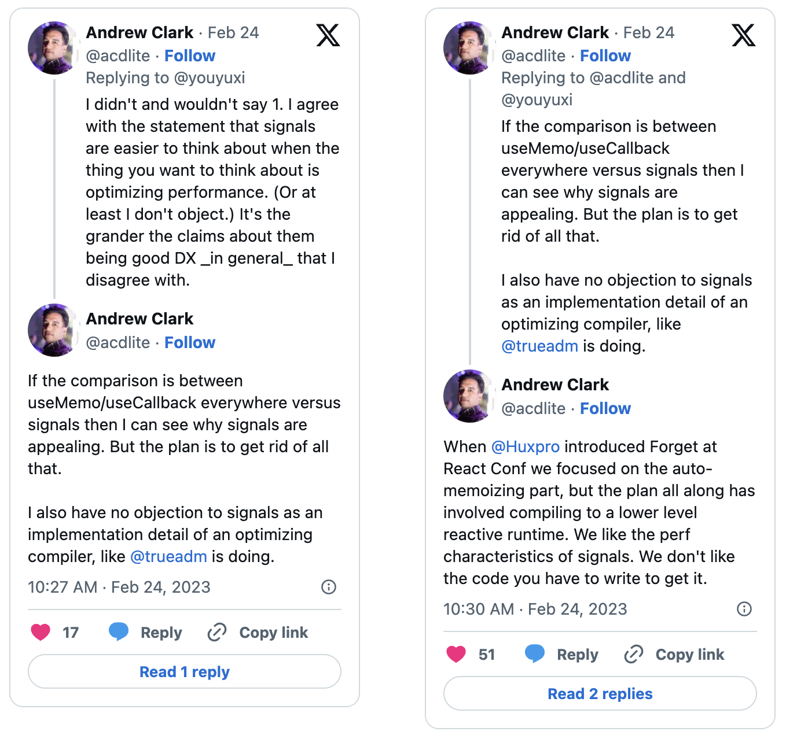

## 시그널

최근 1년간 프론트엔드 생태계에서 꾸준히, 그리고 점점 더 언급되는 이름(혹은 개념)이 있습니다.

그건 바로 시그널(Signal)인데요, 오늘은 시그널이 무엇이고 어째서 최근 프론트엔드 생태계에서 주목을 받고 있는지에 대해 알아보려고 합니다.

## 시그널이 뭔가요?

시그널은 상태 관리를 위한 패턴이자 개념이며, 만약 **vue**, **svelte**, **solid.js**, **Angular** 등을 사용한 경험이 있다면 이미 익숙한 개념일 수 있습니다.

한 줄로 요약하면 **반응성을 제공하는 값을 가진 구현체** 라고 설명할 수 있습니다.

본격적으로 시그널에 대해 알아보기 전에, 시그널의 형태와 사용 사례에 대해 먼저 알아보겠습니다.

### @preact/signals

```jsx
import { signal } from "@preact/signals";

const count = signal(0); // 시그널의 선언

function Counter() {
  return (
    <div>
      <p>Count: {count}</p>
	  {/* count 값의 변경에 따라 UI의 업데이트는 자동으로 이루어진다 */}
      <button onClick={() => count.value++}>click me</button>
    </div>
  );
}
```

### solid.js

```jsx
import { render } from "solid-js/web";
import { createSignal } from "solid-js";

function Counter() {
  const [count, setCount] = createSignal(0); // 시그널의 선언

  setInterval(() => setCount(count() + 1), 1000);

  {/* count 값의 변경에 따라 UI의 업데이트는 자동으로 이루어진다 */}
  return <div>Count: {count()}</div>;
}
```

시그널은 새로운 개념이나 기술이 아닌 옵저버 패턴의 구현이라고 할 수 있는데요, 때문에 각 구현체들간의 인터페이스 차이는 있을지라도 사용 방식은 대동소이합니다.

이 글에서 예시로 사용할 시그널 구현체는 작년 9월 [Preact](https://preactjs.com/) 진영에서 소개한 Signals입니다.

- 💡Preact란?

    _기존 React의 조정자(Reconcilation), 합성 이벤트(SyntheticEvent) 등의 편의기능 + 고도화 기능들을 제거하고 번들 용량과 성능에 올인하는 JSX를 사용한 UI 렌더링 라이브러리입니다.
    React와 달리 번들 크기 절약에 대해 굉장히 어필을 하고 있는데, 10.19.2 버전 기준 압축 용량으로는 4.5kb를 자랑하며 React 진영의 react(2.5kB) + reacto-dom(42kB) 에 비해 확실한 강점을 가지고 있습니다._


## 시그널 개념의 등장

프론트엔드 개발자들은 JSX를 기반으로 한 선언적 UI 개발 방식에 매우 익숙합니다.

이러한 선언적 UI를 구성하기 위해선, 어떤 값의 변화가 UI에 자동으로 반영되도록 하는 반응형 변수나 객체가 필수적입니다.

이를 위해 반응성을 제공하는 다양한 구현 방법에 대한 탐구가 지속되어왔는데, 2010년 7월에 출시된 [Knockout.js](https://knockoutjs.com/)의 observable 객체는 오늘날 **시그널**이라 불리는 기술적 개념의 기반을 형성했습니다.

```jsx
const count = ko.observable(0);

const doubleCount = ko.pureComputed(() => count() * 2);

// logs whenever doubleCount updates
ko.computed(() => console.log(doubleCount()))
```

한 가지 문제점이 있었으니, (비슷한 솔루션을 채택한 Angular.js도 마찬가지로) 이러한 반응형 상태 관리는 양방향 데이터 바인딩으로 인해 점점 어플리케이션의 복잡성을 증가시켰습니다.

반응형 변수가 프로덕트의 이곳 저곳에서 과도하게 사용되면서 UI의 업데이트를 초래하는 요소들을 추적하고 디버깅하는 일이 더욱 어려워졌습니다.

## 리액트의 등장

리액트는 복잡성이 커지는 프론트엔드 생태계에서 **단방향 데이터 바인딩** 개념을 들고 왔습니다.

컴포넌트의 렌더링은 오직 상위 트리의 렌더링 혹은 자체적인 상태 변경을 통해서만 이뤄진다는 단순한 개념으로 프론트엔드 개발자는 더 이상 렌더링의 미로에서 헤매지 않게 되었습니다.



리액트의 단방향 데이터 흐름은 분명한 편의성을 가져왔지만, 리액트의 상태관리 해법은 다소 자유로운(불편한?) 측면이 있었습니다.

리액트의 상태관리에 대한 고민과 개선을 위한 과정에서 단방향 데이터 바인딩의 패러다임을 추종하는 store 중심의 상태 변경 패턴을 가진 **redux**, 반응성과 렌더링 최적화를 위한 atom이라는 개념을 제시한 **recoil**, **jotai** 등 여러 상태관리 라이브러리들이 등장하게 됩니다.

대체 왜 이런 솔루션들이 쏟아져 나오는 것일까요? 리액트 상태관리의 불편함은 무엇일까요?

## 리액트 상태관리?

리액트에서 함수형 컴포넌트의 상태관리는 기본적으로 useState라는 훅을 통해서 이뤄집니다.

```jsx
const [count, setCount] = useState(0)

setCount(count+1)
```

왜 이런 방식으로 상태관리를 해야 하는 것일까요? 그냥 전역변수 하나 선언해두고 쓰면 안 되는 것일까요?

```jsx
let count = 0

function View(){
	const add = () => {
		count++
	}
  return <button onClick={add}>{count}</button>
}
```


리액트의 **함수형 컴포넌트**들은 그 자체로 **순수한 함수**로 동작해야 합니다.

모든 함수형 컴포넌트들은 일반적으로 렌더링이라고 부르는 컴포넌트(함수) 호출 과정에서 완전히 새로 호출되기 때문에, 함수 내부에서 선언한 변수를 통한 상태 관리는 불가능합니다.

- *버튼을 누르면 **count** 의 값은 증가할까요?*

    당연히 증가합니다. 그런데 해당 값이 증가했다는 사실을 리액트가 어떻게 알 수 있을까요?
    만약 리액트가 알 수 없다면 유저는 어떻게 알 수 있을까요? 화면에 보이질 않을텐데 말이죠.


리액트의 모든 컴포넌트들은 연결 리스트(Linked list)로 이어진 하나의 트리입니다. 흔히 가상돔(Virtual DOM) 이라고 말하는 이 노드의 묶음은 JSX와 함께 React의 가장 큰 추상화 포인트입니다.


리액트는 상태의 변화가 감지 되었을 때, 이 트리를 순회하며 순수한 함수로 이루어진 각 컴포넌트를 다시 호출합니다. 이 과정에서 변경된 상태는 컴포넌트의 로직과 함께 UI의 변경사항에 자연스럽게 반영되고, commit, paint 과정을 거쳐 실제 유저에 눈에 보여집니다. 이 과정을 보통 **렌더링/리렌더링** 이라고 합니다.

여기서 중요한 부분은, 리액트가 트리의 DIff를 비교하여 각 노드를 업데이트하고 교체하는 재조정자(Reconciler)를 동작시키 위해서는 필연적으로 **상태가 변경되었다고** **알려주는 트리거가 항상 필요**하다는 점입니다.

*프론트엔드 면접 단골 질문인 **컴포넌트의 렌더링을 트리거 하는 조건은 무엇무엇이 있나요?** 가 바로 이 부분에 대해서 명확하게 이해하고 있는지를 물어보는 질문입니다.*

### Re-render

컴포넌트의 리렌더링 트리거 조건을 개발자가 아닌 리액트 입장에서 보자면 딱 하나뿐입니다.

**scheduleUpdateOnFiber** 라는 이름의 메소드인데, 해당 메소드는 말 그대로 **“리액트 내부 구현체인 Fiber 객체의 업데이트를 스케줄링”** 하는 동작을 합니다.

[ReactFiberWorkLoop](https://github.com/facebook/react/blob/v18.2.0/packages/react-reconciler/src/ReactFiberWorkLoop.new.js#L533)


그리고 해당 메소드가 호출되는 곳은 **useState**, **useReducer** 사용시 내부에서 트리거되는 **dispatchAction** 함수입니다. (class 컴포넌트는 this.setState)

즉, **useState** 혹은 **useReducer**를 사용해야만 React로 하여금 **“이 부분에서 상태 변경이 발생했으니까, 트리의 이 노드 부분은 리렌더링을 해야 해”** 라고 알려줄 수 있는 셈입니다.

이제 **useState**를 사용하지 않은 외부 상태의 변경이 UI의 변화를 일으키지 않는 이유에 대해 알게 되었습니다. 리렌더링이 필요한지 리액트가 알 수 없으니까!

## 그런데 svelte는 잘 동작하잖아요

svelte의 코드 작성 방식은 완전히 다릅니다.

```jsx
<script>
	let count = 0;

	function add() {
		count += 1
	}
</script>

<button on:click={add}>
	{count}
</button>
```

리액트와 달리 svelte의 이 코드는 완벽하게 작동합니다.

비밀은 바로 선언된 **count** 변수를 svelte가 [컴파일 과정](https://en.wikipedia.org/wiki/Source-to-source_compiler)에서 반응성을 제공하는 자체 객체로 변환하기 때문입니다. 그래서 값이 변경될 때 런타임에 해당 값을 사용하는 모든 곳을 찾아 업데이트를 자동으로 실행해 줍니다.

`let count = 0` 가 컴파일 이후에는 `const count = signals(0)` 로 변하게 되는 셈입니다.

## 그래서 시그널이 뭐가 좋은건데?

다시 한 번 시그널을 한 문장으로 정의한다면

**특정한 값을 보유하고 해당 값의 변화를 바탕으로 UI 반응성을 제공하는 객체**라고 할 수 있습니다.

```jsx
import { signal } from "@preact/signals";

const count = signal(0);

function Counter() {
  return (
    <div>
      <p>Count: {count}</p>
      <button onClick={() => count.value++}>click me</button>
    </div>
  );
}
```

전역변수 **let count** 와는 달리, 위 코드는 제대로 동작합니다.

**signal()** 을 통해서 생성된 객체는 **.value** 프로퍼티 통해 값에 접근할 수 있습니다.

만약 **.value**의 변화가 발생한다면 **.value**에 접근한 모든 컴포넌트의 렌더링을 발생시키게 됩니다.

그런데 위의 예제에서는 count 값의 출력을 위해 **.value**를 붙이지 않았는데도 정상적으로 동작합니다.

**@preact/signals**의 또 다른 재미있는 포인트가 여기에 있습니다.

컴포넌트 내부에서 **count.value** 에 접근했다면 **count**의 값이 변할때마다 컴포넌트를 렌더링합니다. 하지만 **count** 자체를 특정 노드의 렌더링에 사용한다면, 정확히 해당 시그널을 사용하는 부분만 렌더링이 일어납니다.

쉽게 말해서 **Counter** 컴포넌트가 아닌 `<p/>` 내부의 `{count}`만 교체됩니다.

컴포넌트 내의 상태 변경이 컴포넌트 전체의 렌더링을 발생시키는 useState와의 결정적인 차이가 여기에 있습니다. 시그널을 사용한다면 마치 정교한 외과 수술을 하듯, 해당 상태의 변경이 반영되어야 하는 노드만 정확하게 리렌더링을 할 수 있게 됩니다.

### 어떻게 이렇게 할 수 있는 건가요?

앞서 살펴보았듯이, 리액트의 리렌더링은 오직 **scheduleUpdateOnFiber** → **DispatchAction** → **useState, useReducer** 로만 트리거가 가능한데 시그널에서는 어떻게 이런 동작이 가능한걸까요?

또한 리액트는 기본적으로 **컴포넌트 단위의 리렌더링**이 일어나는데 컴포넌트의 리렌더링이 없이 어떻게 count 값을 바꿀 수 있는 걸까요?

마법같은 일이 일어나는 것처럼 보이지만 세상에 마법은 없는 법… **@preact/signals** 소스코드를 살펴보면서 비밀을 파헤쳐보겠습니다. 가장 중점적으로 봐야 하는 부분은 시그널과 리액트의 인터페이스를 연결하는 부분입니다.

```tsx
import { installAutoSignalTracking } from "@preact/signals-react/runtime";
installAutoSignalTracking();
```
[https://github.com/preactjs/signals/blob/main/packages/react/auto/src/index.ts](https://github.com/preactjs/signals/blob/main/packages/react/auto/src/index.ts)

<p>&nbsp;</p>

실질적으로 리액트의 렌더링 로직과 시그널의 인터페이스를 통합하는 코드들은 **@preact/signals-react-runtime** 내부에 있는 **installAutoSignalTracking** 메소드로 정의되어 있었습니다.

<p>&nbsp;</p>

[https://github.com/preactjs/signals/blob/main/packages/react/runtime/src/auto.ts](https://github.com/preactjs/signals/blob/main/packages/react/runtime/src/auto.ts)

[https://github.com/preactjs/signals/blob/main/packages/react/runtime/src/index.ts](https://github.com/preactjs/signals/blob/main/packages/react/runtime/src/index.ts)

<p>&nbsp;</p>

먼저 **runtime/src/auto.ts** 파일을 살펴보니 익숙한 리액트 내부 구현체 이름이 보입니다.

```tsx
import {
	// @ts-ignore-next-line
	// eslint-disable-next-line @typescript-eslint/no-unused-vars
	__SECRET_INTERNALS_DO_NOT_USE_OR_YOU_WILL_BE_FIRED as ReactInternals,
} from "react";
```

**__SECRET_INTERNALS_DO_NOT_USE_OR_YOU_WILL_BE_FIRED** 객체는 리액트 내부 구현체들간에 동일한 컨텍스트를 공유하기 위한 네임스페이스입니다. 딱 봐도 함부로 쓰면 잘릴 것 같이 생겼습니다.

시그널에서는 이 중 **ReactCurrentDispatcher**에 대한 **set**에 개입합니다.

```tsx
//...
let currentDispatcher: ReactDispatcher | null = null;

function installCurrentDispatcherHook() {
	isAutoSignalTrackingInstalled = true;

	Object.defineProperty(ReactInternals.ReactCurrentDispatcher, "current", {
		get() {
			return currentDispatcher;
		},
		set(nextDispatcher: ReactDispatcher) {
			if (lock) {
				currentDispatcher = nextDispatcher;
				return;
			}

      const currentDispatcherType = getDispatcherType(currentDispatcher);
			const nextDispatcherType = getDispatcherType(nextDispatcher);

			// Update the current dispatcher now so the hooks inside of the
			// useSyncExternalStore shim get the right dispatcher.
			currentDispatcher = nextDispatcher;
			if (
				isEnteringComponentRender(currentDispatcherType, nextDispatcherType)
			) {
				lock = true;
				store = _useSignalsImplementation(1);
				lock = false;
			} else if (
				isRestartingComponentRender(currentDispatcherType, nextDispatcherType)
			) {
				store?.f();
				lock = true;
				store = _useSignalsImplementation(1);
				lock = false;
			} else if (
				isExitingComponentRender(currentDispatcherType, nextDispatcherType)
			) {
				store?.f();
				store = null;
			}
		},
	});
}
```
[https://github.com/preactjs/signals/blob/main/packages/react/runtime/src/auto.ts#L158](https://github.com/preactjs/signals/blob/main/packages/react/runtime/src/auto.ts#L158)

<p>&nbsp;</p>


[ReactCurrentDispatcher_PROD](https://stately.ai/viz/29fcbb2b-5a6a-4df4-b5fd-a2322066f4a7)

**ReactCurrentDispatcher**는 리액트 내부 구현체에서 사용하는 디스패쳐로  **useState** , **useEffect** 등 모든 훅의 **현재** 구현체를 가지고 있습니다.

리액트에서는 렌더링 시점에 따라 여러 종류의 **Dispatcher**가 교환되어 사용됩니다.

예를 들면, 컴포넌트가 마운트 되는 시점에 사용되는 **useState** 구현체와 마운트 이후 리렌더링 되는 시점에 사용되는 **useState**는 서로 다른 구현체입니다.

마운트 시점에 해줘야 하는 일과 이미 마운트 된 컴포넌트에서 동작해야 하는 로직이 다르기 때문입니다.

- [Current Fiber의 상태에 따라 **Dispatcher**를 선택하여 사용합니다.](https://github.com/facebook/react/blob/v18.2.0/packages/react-reconciler/src/ReactFiberHooks.new.js#L428)
`(HooksDispatcherOnMount / HooksDispatcherOnUpdate)`


리액트는 이렇게 렌더링의 특정 주기에 맞게 **Dispatcher**를 교체하여 하나의 구현체로 여러 일을 할 수 있게 구현되어 있습니다.

- [개발 환경에서는 DEV 구현체로 교체해주는것도 이 방식을 사용합니다.](https://github.com/facebook/react/blob/v18.2.0/packages/react-reconciler/src/ReactFiberHooks.new.js#L470)

이러한 사실을 바탕으로 위 코드를 대략적으로 살펴보자면, **ReactCurrentDispatcher**의 변경을 감지해서 **이전 Dispatcher**와 **현재 Dispatcher**의 타입 정보를 바탕으로 현재 렌더링 시점을 파악하는 로직이라고 할 수 있습니다.

`isEnteringComponentRender` : 컴포넌트의 렌더링이 막 시작하려는 시점입니다 (Mount)

`isRestartingComponentRender` : 컴포넌트의 리렌더링이 일어나는 시점입니다. (Re-render)

`isExitingComponentRender` : 컴포넌트가 정리되는 시점입니다. (Unmount)

_이 방식이 가능한 이유는 렌더링 시점에 따라 Dispatcher가 바뀌기 때문입니다. Dispatcher를 교체하는 내부 구현을 통해 Dispatcher이름을 얻어내서 렌더링 시점을 역으로 유추한다...?_

<p>&nbsp;</p>


컴포넌트의 마운트 시점과 리렌더링 시점에 주입되는 useSignal 구현체는 다음과 같습니다.

```tsx
/**
 * Custom hook to create the effect to track signals used during render and
 * subscribe to changes to rerender the component when the signals change.
 */
export function _useSignalsImplementation(
	_usage: EffectStoreUsage = UNMANAGED
): EffectStore {
	ensureFinalCleanup();

	const storeRef = useRef<EffectStore>();
	if (storeRef.current == null) {
		storeRef.current = createEffectStore(_usage);
	}

	const store = storeRef.current;
	useSyncExternalStore(store.subscribe, store.getSnapshot, store.getSnapshot);
	store._start();

	return store;
}
```

**useSyncExternalStore**를 사용해서 리렌더링을 트리거하는 것을 볼 수 있습니다. (리액트18에서 추가된 훅으로, 외부 저장소의 상태 변경을 통해 리액트의 렌더링을 트리거 할 수 있도록 지원하는 훅입니다.)

우리가 궁금한 부분은 **어떻게 전체 컴포넌트가 아니라 딱 시그널을 사용하는 jsx 노드만 업데이트 할 수 있는 것인가**이기 때문에 해당 부분을 중점적으로 살펴보겠습니다.

```tsx

export function installJSXHooks() {
	const JsxPro: JsxRuntimeModule = jsxRuntime;
	const JsxDev: JsxRuntimeModule = jsxRuntimeDev;

	/**
	 * createElement _may_ be called by jsx runtime as a fallback in certain cases,
	 * so we need to wrap it regardless.
	 *
	 * The jsx exports depend on the `NODE_ENV` var to ensure the users' bundler doesn't
	 * include both, so one of them will be set with `undefined` values.
	 */
	React.createElement = wrapJsx(React.createElement);
	JsxDev.jsx && /*   */ (JsxDev.jsx = wrapJsx(JsxDev.jsx));
	JsxPro.jsx && /*   */ (JsxPro.jsx = wrapJsx(JsxPro.jsx));
	JsxDev.jsxs && /*  */ (JsxDev.jsxs = wrapJsx(JsxDev.jsxs));
	JsxPro.jsxs && /*  */ (JsxPro.jsxs = wrapJsx(JsxPro.jsxs));
	JsxDev.jsxDEV && /**/ (JsxDev.jsxDEV = wrapJsx(JsxDev.jsxDEV));
	JsxPro.jsxDEV && /**/ (JsxPro.jsxDEV = wrapJsx(JsxPro.jsxDEV));
}

export function installAutoSignalTracking() {
	installCurrentDispatcherHook();
	installJSXHooks();
}
```

[https://github.com/preactjs/signals/blob/main/packages/react/runtime/src/auto.ts#L360C1-L383C2](https://github.com/preactjs/signals/blob/main/packages/react/runtime/src/auto.ts#L360C1-L383C2)

<p>&nbsp;</p>

앞서 확인했듯이, 시그널과 리액트의 인터페이스 연동은 **installAutoSignalTracking** 이라는 함수를 통해 이뤄집니다.

해당 함수에서는 두 가지 함수를 호출하는데, 먼저 **installCurrentDispatcherHook**에서는 리액트 렌더링 주기를 파악하여 **useSingal** 훅의 동작을 개입시키는 역할을 해주는 것을 확인했습니다.

두 번째는 **installJSXHooks** 라는 함수입니다. 해당 함수는 **wrapJSX** 라는 [데코레이터](https://refactoring.guru/design-patterns/decorator)를 통해 기본 JSX 변환 함수와 **React.createElement**의 기능을 확장하고 있습니다.

이제 **wrapJsx** 함수를 살펴보겠습니다.


```tsx

export function wrapJsx<T>(jsx: T): T {
  if (typeof jsx !== "function") return jsx;

  return function (type: any, props: any, ...rest: any[]) {
    if (typeof type === "string" && props) {
      for (let i in props) {
        let v = props[i];
        if (i !== "children" && v instanceof Signal) {
          props[i] = v.value;
        }
      }
    }

    return jsx.call(jsx, type, props, ...rest);
  } as any as T;
}

```
[https://github.com/preactjs/signals/blob/main/packages/react/runtime/src/index.ts#L76](https://github.com/preactjs/signals/blob/main/packages/react/runtime/src/index.ts#L76)

<p>&nbsp;</p>

컴포넌트의 type은 렌더링 대상이 되는 JSX의 타입을 나타냅니다.

함수형 컴포넌트가 아닌 호스트 컴포넌트(react-dom 기준 **div, p** 와 같은 **DOMComponent**)의 경우 타입은 해당 태그의 문자열로 표현됩니다. 함수형 컴포넌트의 경우 컴포넌트 함수 그 자체를 가리킵니다.

```tsx
console.log(<p/>); // type: "p"
console.log(<App/>); // type: function App(){}
```



따라서 위 코드는 호스트 컴포넌트의 props 중에서, children을 제외하고 signal이 있는 경우 signal의 value를 사용하게끔 변환해주는 코드라는 것을 알 수 있습니다.

💡 위 코드 구현부를 통해 다음 두 코드가 동일하다는 것을 알 수 있겠네요!
1. `<input max={maxSignal}/>`
2. `<input max={maxSignal.value}/>`

둘 중 어느 형태로 사용하던 해당 컴포넌트 전체가 리렌더링이 된다는 것을 짐작할 수 있습니다.


이제 마법처럼 보였던, **텍스트 노드만 단일 렌더링되어 컴포넌트의 전체 리렌더링이 발생하지 않는 케이스** 의 동작 원리를 살펴볼 차례입니다.

같은 파일의 아래 부분에서 SIgnal의 프로토타입을 재정의하는 부분을 확인할 수 있습니다.


```tsx
/**
 * A wrapper component that renders a Signal's value directly as a Text node or JSX.
 */
function SignalValue({ data }: { data: Signal }) {
  const store = _useSignalsImplementation(1);
  try {
    return data.value;
  } finally {
    store.f();
  }
}

// Decorate Signals so React renders them as <SignalValue> components.
Object.defineProperties(Signal.prototype, {
  $$typeof: { configurable: true, value: ReactElemType },
  type: { configurable: true, value: SignalValue },
  props: {
    configurable: true,
      get() {
        return { data: this };
      },
  },
  ref: { configurable: true, value: null },
});
```
[https://github.com/preactjs/signals/blob/main/packages/react/runtime/src/index.ts#L338C1-L361C4](https://github.com/preactjs/signals/blob/main/packages/react/runtime/src/index.ts#L338C1-L361C4)

<p>&nbsp;</p>

**Signal** 객체는 리액트 컴포넌트로 보여지기 위해 마치 **React.createElement** 를 통해 탄생한 것 처럼 본인을 꾸며주고 있습니다. 리액트에서 JSX 내부에서 컴포넌트의 종류를 확인하는 type 프로퍼티에 SignalValue라는 함수형 컴포넌트를 넣어주고 있네요!

- [ReactElement의 타입과 동일한 `$$typeof` 값을 사용](https://github.com/facebook/react/blob/main/packages/react/src/jsx/ReactJSXElement.js#L148C1-L151C34)


이렇게 되면 JSX에 렌더링된 시그널 객체는 리액트로 하여금 **ReactElement** 객체로 여겨지고, type 프로퍼티를 통해 렌더링된 함수형 컴포넌트 **SignalValue** 가 그 자리를 차지하게 될 겁니다.

즉, 아래 코드는

```tsx
<div>
 {countSignal}
</div>
```

이렇게 변하게 되는 셈입니다.

```tsx
<div>
  <SignalValue data={countSiganl} />
</div>
```

**이제 모든 비밀이 풀렸습니다!**

코드를 작성하는 개발자는 JSX 노드에 시그널 값을 직접 넣어주지만, 실제로는 **SingalValue**라는 컴포넌트로 변경되는 셈입니다!

시그널을 사용했을 때 관찰했던 현상은 **컴포넌트 전체 렌더링이 발생하지 않네?** 였지만, 실제로는 시그널 자체가 하나의 작은 컴포넌트로 변환되기 때문에 **SignalValue** 컴포넌트만 리렌더링이 일어나고 있었습니다.

## 리액트는 왜 이렇게 하지 않을까?

여러 rfc 문서나 트위터(X)에 올라오는 리액트 핵심 개발자들의 반응들을 보다 보면, 리액트 역시 자체적인 상태관리 로직에 불편한 점과 비효율적인 부분이 있다는 점을 일부 인지하고 있는 것으로 보입니다.

왜 리액트는 시그널과 같은 해결책을 자체적인 대안으로 제시하지 않는 걸까요?

태생부터 양방향 바인딩에서 오는 프론트엔드 어플리케이션의 복잡성을 타파하기 위해 등장한 만큼, 리액트는 Flux패턴을 바탕으로 한 단일 데이터 흐름을 지향하고 있습니다.



일견 양방향 데이터 바인딩처럼 보이는(사실 그렇진 않지만) 시그널과 같은 반응형 객체를 통한 로직을 과도하게 사용할 경우 상태 제어의 흐름을 알기 어렵게 만들고 리액트가 해결하려던 최초의 문제를 다시 재현할 가능성이 크다는 우려가 있는 것으로 보입니다. 양방향 바인딩에 대한 공포도 남아있는 것 같구요.

---

태생부터가 이러한 문제들의 해결책으로부터 등장한 리액트인 만큼, 일견 이러한 조심스러운 태도가 이해되기도 합니다.

다소 비용이 들더라도 전체 렌더 트리를 다시 호출하면서 컴포넌트 단위(Fiber 객체)의 비교를 통해 트리의 노드를 교체하거나 갱신하는 것이 결과적으로는 가장 부작용을 줄이고 문제를 최소화 하는 해결책으로 보는게 아닐까요?

Dan Abramov의 최근 코멘트에서도 이러한 입장을 다시 확인할 수 있었습니다.

> 💡 …
> In React, *all your rendering logic is your "template"*. This lets you use `if` statements and control flow without regrouping your code around every value you render. This also ensures that the user *always* sees fresh values. That's what I meant by React not "missing" updates. React doesn't let you write rendering logic that leaves initialization and updates out of sync.
>
> [https://dev.to/this-is-learning/react-vs-signals-10-years-later-3k71#comment-256g9](https://dev.to/this-is-learning/react-vs-signals-10-years-later-3k71#comment-256g9)

Dan Abramov가 생각하는 리액트는 컴포넌트 자체를 이미 하나의 **순수한 템플릿** 으로 간주하고 있으며, 컴포넌트 내부에 선언된 모든 함수와 로직이 매 렌더링시마다 동일하게 동작하도록 보장하는 것을 가장 중요하게 생각하고 있습니다.

이러한 관점에서 보면 매 렌더링시마다 값이 유지되는 **useState, useMemo, useRef** 들이 오히려 템플릿의 예외케이스가 되는 셈입니다. 리액트 개발자들은 리액트가 프레임워크가 아닌 view 라이브러리라고 주장하는데, 그 의견과도 일맥상통한다고 할 수 있겠네요.

<p>&nbsp;</p>

**요약하자면,**

시그널이 **상태가 변경되는 곳을 잘 감지해서 그 부분만 골라서 리렌더링을 해줄게** 라면,
리액트는 **상태의 변경이 영향을 줄 수 있는 곳들을 전부 다시 계산해서 일관된 동작을 보장해줄게**  라는 태도에 가깝다고 생각합니다.

리액트가 무엇인지, 무엇을 추구해야 하는지에 대한 위 의견에 동의하는지 여부와는 별개로, 실제로 리액트 코드를 작성하는 개발자 입장에서는 의존성 배열 등 개발자 경험에 있어 다소 불편하고 의아스러운 부분이 분명히 있다고 생각합니다.

전 세계 리액트 개발자들 중 **useEffect, useMemo, useCallback**를 사용하면서 의존성 배열에 누락한 특정 값 때문에 버그를 겪지 않은 사람이 있을까요?

<p>&nbsp;</p>

물론 리액트 팀에서도 이런 불편함을 해결하기 위해 진행중인 프로젝트가 있습니다.

**React Forget** 이라고 불리는 이 프로젝트는 Babel, SWC 등의 트랜스파일러와의 협업을 바탕으로 컴파일 단계에서 반응성이 필요한 모든 변수를 파악하고 메모이제이션을 하려는 시도입니다.

<div class="video-container">
  <iframe width="100%" height="315" src="https://www.youtube.com/embed/lGEMwh32soc?si=Uu-YZ393Yfi_M7YG" title="YouTube video player" frameborder="0" allow="accelerometer; autoplay; clipboard-write; encrypted-media; gyroscope; picture-in-picture; web-share" allowfullscreen></iframe>
</div>

*발표한지 2년이 되었는데 들리는 이야기로는 아직 알파단계라는…*

이 시도가 성공하면 의존성 배열로 인한 고통은 옛말이 될 수도 있겠네요.

## 시그널의 명과 암

앞서 시그널은 새로운 개념도 기술도 아니라고 말했지만, 최근 다시 주목받는 이유가 분명히 있다고 생각합니다.

- 리액트 상태관리의 복잡성
- 렌더링 최적화를 잘 하기 위해 지저분한 메모이제이션 훅들이 필요하다는 점
- 결국 상태 관리를 잘 하려면 리액트 내부 구현에 대한 이해가 있어야 한다는 점

얼핏 보면 시그널은 이러한 고통을 끝내줄 수 있는 은탄환처럼 보이기도 합니다.



***solid.js의 시그널 기반 디버깅 툴***

*컴파일 단계에서 추적되는 시그널은 컴포넌트의 렌더링 요소를 분석하기 위한 새로운 지평을 열 지도 모릅니다.*

### 시그널 찬성파

상태 관리 패턴으로서 시그널을 찬성하는 사람들의 논리는 다음과 같습니다.

**solid.js**나 **@preact/signals** 구현체는 양방향 데이터 바인딩처럼 보이지만, 실제 구현부를 보면 리액트의 단방향 데이터 바인딩의 패턴을 깨지 않기 때문에 기존의 혼란이 다시 발생하지 않을 것이라고 이야기합니다.

특히 각 컴포넌트 내부의 시그널 변경이 push/pull 방식을 통해 UI에 반영되기 때문에 렌더링의 일관성과 디버깅의 용이성에는 문제가 없다고 주장합니다.

- 💡 push/pull 방식?

  _상태 변경이 필요하다는 알림은 push를 통해 즉각적으로 알리고, 변경된 상태가 반영되고 조회되는 시점은 비 동기적으로 지연시킬 수 있는 구현 방식을 말합니다.
  이를 통해 거미줄처럼 전파되는 상태의 변경을 쉽게 배치로 묶어 한 번에 처리하거나, 불필요하게 같은 계산을 두 번 하는 등의 낭비를 줄일 수 있습니다._


컴파일 단계의 반응성을 제공하는 아이디어를 통해 초기 로드 번들 사이즈를 최적화 하여 재개 가능성을 높일 수 있으며, 시그널 기반 디버깅 툴을 통해 상태 변경이 영향을 주는 컴포넌트를 명확히 살펴볼 수 있다는 점도 장점으로 꼽습니다.

또한, VDOM을 비교하면서 생기는 연산에 들어가는 메모리와 CPU 자원등의 불필요한 성능 문제에서도 비교적 자유로울 수 있다는 점. 무엇보다도 렌더링 최적화를 떠나 기존의 **useState**, **useMemo** 훅을 사용하던 경험에 비하면 개발자 경험(DX)에 있어서도 더 나은 경험이라는 것이 시그널 찬성파의 주장입니다.

### 시그널 반대파

시그널을 반대하는 사람들의 논리는 다음과 같습니다.

그들은 이미 **useState** , **useReducer** 과 같은 상태관리 훅으로 할 수 없는 상태 관리는 없다고 주장합니다.

또한, 시그널 자체가 새로운 개념이 아닐 뿐더러 반응성을 가진 객체의 남용으로 인해 코드베이스의 복잡성을 키우고 문제를 일으켰던 패턴을 왜 다시 가져오려고 하는지 모르겠다고 이야기합니다.

시그널의 접근 방식(디테일한 반응성 제공)은 만약 로직의 빈틈이 생겼을 때 그 사이드 이펙트를 추적하기 어려울 뿐만 아니라 기존 리액트 동작 방식에 비해 더 일관되지 않은 결과물을 만들 수 있다는 점도 단점으로 꼽혔습니다.

### @preact/signals 반대파

시그널의 패러다임이나 개념을 리액트에 도입하는 것과는 별개로, 리액트에서 **@preact/signals** 를 사용하는 것 자체에 대한 반대 의견도 많았습니다.

Dan Abramov 역시 preact 진영의 시그널 구현체를 사용하지 않을 것을 권고했습니다.
> Preact Signals는 React의 공개 API를 오버라이딩하는 것 외에도 React 내부를 가져다가 패치하면서 그것들이 어떻게 작동하는지에 대한 불안정한 가정에 의존합니다. 이 라이브러리는 React를 사용하는 완전히 지원되지 않는 방법입니다. 최근에 안정적인 릴리스를 하지 않았던 것이 이 라이브러리가 계속해서 문제가 발생하지 않는 유일한 이유입니다.
> React가 하드웨어 조각이라면, 이것은 정확히 보증을 무효화시키는 종류의 것입니다. 여기서 디버깅 문제를 도와드릴 수 없으며, 많은 부분이 조작되었기 때문에 우리는 그것들을 버그로 간주하지 않습니다.
>
> [Bug: clicking a material ui button with preact signals present crashes react with Uncaught Error: Should have a queue. This is likely a bug in React. Please file an issue. · Issue #26704 · facebook/react](https://github.com/facebook/react/issues/26704#issuecomment-1522044060)

사실 개인적으로도 Preact의 시그널 구현체를 보면서 우려스러웠던 부분이 많았습니다. 특히 **getDispatcherType** 구현체에서는 디스패쳐를 통해 접근한 리액트 소스코드 내부의 함수 이름(…)을 정규식으로 찾아내서 **DispatcherType** 에 대한 가정을 하는 로직이 다수 존재했습니다.

```tsx
    let useReducerImpl = dispatcher.useReducer.toString();
		if (
			/rerenderReducer/.test(useReducerImpl) ||
			/return\s*\[\w+,/.test(useReducerImpl)
		) {
			type = RerenderDispatcherType;
    }
```
[https://github.com/preactjs/signals/blob/6b6af05d433b4d2a8da0be5a65ba5305d49e7b73/packages/react/src/index.ts#L333](https://github.com/preactjs/signals/blob/6b6af05d433b4d2a8da0be5a65ba5305d49e7b73/packages/react/src/index.ts#L333)

<p>&nbsp;</p>

프로덕션 레벨의 어플리케이션을 운영하고 유지보수한다면, 추후 리액트의 세부 구현 변경(리팩토링 하면서 메소드 이름만 바뀌어도…)에 따라 쥐도새도 모르게 동작하지 않을 코드가 될 수도 있다는 점은 **@preact/siganls** 의 도입에 있어 큰 위험 요인이라고 할 수 있습니다.

## 번외: Signal을 직접 만들어보자

지금까지 위에서 배운 바를 활용하면 직접 반응성 객체인 시그널을 만들어 볼 수 있습니다.

저는 **class**와 **useSyncExternalStore**  훅을 활용해서 약 70줄의 코드로 그럴듯한 시그널 코드를 만들어 봤습니다. computed, effect 등 유틸적인 부분과 디테일한 성능 부분을 고려하지 않은 의사 코드이니 재미로만 봐주세요.

### 자체 구현 시그널 코드

```tsx
import { useSyncExternalStore } from "react";

export class Signal<T = unknown> {
  private _value: T
  subscribers: Set<() => void> = new Set()

  constructor(value: T) {
    this._value = value
  }

  get value() {
    return (()=> {
      try {
        /**
         * 컴포넌트 최상위가 아닌 곳에서 useSignal을 호출하면 아래 에러가 발생한다.
         *  "Invalid hook call. Hooks can only be called inside of the body of a function component."
         *  이 경우 렌더링이 필요한 곳이 아니라고 판단하여 _value를 반환한다.
         */
        return useSignal(this);
      }catch {
        return this._value;
      }
    })()
  }

  set value(newValue: T) {
    // 이전 값과 같다면 리렌더링을 하지 않는다.
    if(this._value === newValue) return;

    this._value = newValue;
    this.notifyChange();
  }

  get asNode() {
    return <SignalNode signal={this}/>
  }

  /**
   * 아래는 React useSyncExternalStore 로직과 통합하기 위한 코드
   */
  private subscribe = (onStoreChange: () => void) => {
    this.subscribers.add(onStoreChange);
    return () => {
      this.subscribers.delete(onStoreChange);
    }
  }
  private notifyChange = () => {
    this.subscribers.forEach((subscriber) => {
      subscriber();
    })
  }
  private getSnapshot = () => {
    return this._value;
  }
  static subscribe<T>(signal: Signal<T>) {
    return signal.subscribe
  }
  static getSnapshot<T>(signal: Signal<T>) {
    return signal.getSnapshot
  }
}

function useSignal<T>(signal: Signal<T>) {
  return useSyncExternalStore(Signal.subscribe(signal), Signal.getSnapshot(signal))
}

function SignalNode<T>({ signal }: { signal: Signal<T> }) {
  return useSignal(signal)
}
```

### 사용 코드

```tsx
import { Signal } from "./CustomSignal.tsx";

const text = new Signal("hello"); // Signal<string>

function CustomSignalApp() {
  const updateCustomSignal = () => {
    // text.value를 함수 내부에서 사용하면 리렌더링이 동작하지 않습니다.
    text.value = text.value + " world"
  }

  // text.value를 컴포넌트 최상위에서 사용하면 리렌더링이 동작합니다.
  // console.log(text.value)
  console.log("render CustomSignalApp")

  return (
    <div className="App">
      <TextComponent text={text} />
      <button onClick={updateCustomSignal}>add world</button>
    </div>
  );
}

const TextComponent = ({ text }: { text: Signal<string> })  => {
  console.log("render TextComponent")

  // asNode를 사용하면 text의 변경에도 TextComponent의 리렌더링이 발생하지 않습니다.
  return <p>{text.asNode}</p>
}

export default CustomSignalApp;
```


## 마치며

리액트의 현재 상태관리 방식이 불편하다는 공감대는 분명히 존재하며, 그 문제를 해결하기 위해 **valtio** , **jotai** 등의 반응성을 제공하는 라이브러리들이 탄생했습니다. 최근에는 한 발 더 나아가 좀 더 정교한 반응성을 제공하기 위한 수단으로 시그널이 다시 주목받고 있는 것 같습니다.

---

[react issue: 배울건 배웁시다](https://github.com/facebook/react/issues/27164)



[Andrew Clark의 트윗](https://twitter.com/acdlite/status/1628930249718202369)

> useMemo/useCallback 남발할거면 signal 쓰는게 더 편한건 인정. 하지만 React Forget 믿고 기다려주겠니?

---

사이드 프로젝트에서 사용해본 **@preact/signals** 의 사용 경험이 좋아 더 깊게 공부하던 중 시그널의 개념과 패턴에 대한 새로운 사실을 많이 알게 된 것 같습니다.
시그널에 대한 여러 의견과 논쟁을 둘러보며 오랜만에 리액트 생태계의 상태 관리에 대한 다양한 이야기를 접하고 또 고민해 볼 수 있는 계기였습니다.

과연 **React Forget**이 빠른 시간 내에 등장해서 고통받는 리액트 개발자들을 구원해 줄 수 있을지, 아니면 또 다른 아이디어의 등장으로 완전히 다른 방향으로 상태관리의 패러다임이 바뀌게 될지 앞으로의 추이를 지켜보는 것도 매우 흥미진진한 일이 될 것 같습니다.

## 예시 코드

[github.com/Jonghakseo/react-signal-example](https://github.com/Jonghakseo/react-signal-example)

## 레퍼런스

[The Evolution of Signals in JavaScript](https://dev.to/this-is-learning/the-evolution-of-signals-in-javascript-8ob)

[Let’s learn how modern JavaScript frameworks work by building one](https://nolanlawson.com/2023/12/02/lets-learn-how-modern-javascript-frameworks-work-by-building-one/)

[SolidJS](https://www.solidjs.com/tutorial/introduction_signals)

[Signals – Preact Guide](https://preactjs.com/guide/v10/signals/)

[https://github.com/preactjs/signals](https://github.com/preactjs/signals)

[Super Charging Fine-Grained Reactive Performance](https://dev.to/modderme123/super-charging-fine-grained-reactive-performance-47ph)

[Observer pattern](https://en.wikipedia.org/wiki/Observer_pattern)

[Becoming fully reactive: an in-depth explanation of MobX | HackerNoon](https://hackernoon.com/becoming-fully-reactive-an-in-depth-explanation-of-mobservable-55995262a254)

[Angular in Depth](https://angularindepth.com/posts/1008/inside-fiber-in-depth-overview-of-the-new-reconciliation-algorithm-in-react)

[React vs Signals: 10 Years Later](https://dev.to/this-is-learning/react-vs-signals-10-years-later-3k71)

[React 톺아보기 - 03. Hooks_1 | Deep Dive Magic Code](https://goidle.github.io/react/in-depth-react-hooks_1/)
