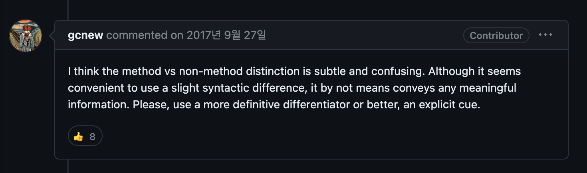

## Covariance and Contravariance

"Covariance" and "contravariance" are concepts that every TypeScript developer encounters and uses daily, yet—myself included—few of us consciously think about them when designing interfaces.

Before understanding the significance of covariance and contravariance in TypeScript, let's first understand what they actually mean.

### Covariance

You can use a more derived (more specific) type.

An instance of type I<T'> can be assigned to a variable of type I<T>.

### Contravariance

You can use a less derived (more generic) type.

An instance of I<T> can be assigned to a variable of type I<T'>.



Even when trying to explain it simply, it's hard to make it intuitive—so let's look at examples.

Consider the following types A, B, and C:

```typescript
type A = string
type B = string | number
type C = string | number | null
```

Now let's declare a function type called Foo:

```typescript
type Foo = (b: B) => B;
```

Which of the following functions can safely be called while respecting this function type?

```typescript
const foo1: Foo = (a: A) => {
  return {} as A;
};

const foo2: Foo = (a: A) => {
  return {} as C;
};

const foo3: Foo = (c: C) => {
  return {} as C;
};

const foo4: Foo = (c: C) => {
  return {} as A;
};
```

A is a subtype of B, and B is a subtype of C. Therefore, A is a subtype of C.

(The inverse relationship is a supertype.)

**Let's examine foo1 first. Is this function safe?**

The parameter A is a subtype of B, missing `number`. A caller conforming to the Foo interface could pass `number` as an argument, but foo1 has no handling for it—this looks dangerous.

For the same reason, foo2, which takes the same parameter type, also looks unsafe.

**Let's examine foo3. Is this function safe?**

The parameter C is a supertype of B, which is B plus `null`. A caller conforming to the Foo interface would pass `string | number`. In this case, the parameter handling is safe.

Now let's look at the return value. C is B plus `null`. A caller conforming to the Foo interface would handle `string` and `number` as the return type. An unexpected `null` could be returned—this looks dangerous.


**Let's examine foo4. Is this function safe?**

The parameter C is safe as we established with foo3. Now the return value—A is B minus `number`. A caller conforming to the Foo interface would handle `string | number` as the return, but the actual return type is only `string`.

Therefore, foo4 is a safe function in both parameter and return value!

### What?

It's not easy to understand intuitively—which is why I explained it through actual call scenarios—but it might still be confusing even after the explanation.

However, from the examples above, we can discover two rules:

1. Function parameters can use a wider type. (Contravariance — a more generic type can be used)
2. Function return values can use a narrower type. (Covariance — a more specific type can be used)

Function types in TypeScript operate by these rules.

However, this assumption holds when TypeScript's `strict` flag—specifically `strictFunctionTypes`—is enabled. When this flag is off, function parameters behave with both covariance and contravariance. This is called "bivariance."

#### Why?

As we saw in the use cases, having parameters be contravariant is the safe choice. So why isn't that the default in TypeScript?

The truth is, contravariant parameters aren't appropriate in every use case.

Consider the signature of `Array.push`:

```typescript
interface Array<T> {
    push(...items: T[]): number;
}
```

If you want to push a `string` into an `Array<string | number>`, you'd use the push method.

In this case, `push()`'s type becomes `(...items: Array<string | number>) => number`.

Per function parameter contravariance, you shouldn't be able to assign `(...items: Array<string>) => number` to it.

Now something feels logically off again.

Adding a string to an array of numbers and strings isn't unsafe, so in this case the function parameter *should* be covariant—leading us to the conclusion that contravariance isn't always correct.


#### But Array.push() works fine in --strict mode?

Correct. Many TypeScript developers, myself included, keep the strict flag on for type safety, yet we never encounter contravariance issues with `Array.push`.

The secret lies in the method declaration syntax:

```typescript
interface Array<T> {
    push(...items: T[]): number;
}

interface Array<T> {
    push: (...items: T[]): number;
}
```

The first declaration style and the second declaration style behave differently!

https://github.com/microsoft/TypeScript/pull/18654

> The stricter checking applies to all function types, except those originating in method or constructor declarations. Methods are excluded specifically to ensure generic classes and interfaces (such as Array<T>) continue to mostly relate covariantly.

They've left the door open for covariance through a subtle, hard-to-spot syntax difference.

> By the way, note that whereas some languages (e.g. C# and Scala) require variance annotations (out/in or +/-), variance emerges naturally from the actual use of a type parameter within a generic type due to TypeScript's structural type system.

Would it have been better to expose this concept explicitly like C#, Scala, or Kotlin?

I can't help but think that adding explicit keywords would have been better than controlling variance through such a subtle syntax difference...


**Update**

Starting with TypeScript 4.7, you can explicitly annotate variance on type generics:

```typescript
type Getter<out T> = () => T;

type Setter<in T> = (value: T) => void;
```

https://www.typescriptlang.org/docs/handbook/release-notes/typescript-4-7.html#optional-variance-annotations-for-type-parameters

### References

- https://learn.microsoft.com/ko-kr/dotnet/standard/generics/covariance-and-contravariance
- https://seob.dev/posts/%EA%B3%B5%EB%B3%80%EC%84%B1%EC%9D%B4%EB%9E%80-%EB%AC%B4%EC%97%87%EC%9D%B8%EA%B0%80/
- https://edykim.com/ko/post/what-are-covariance-and-contravariance/
- https://github.com/microsoft/TypeScript/pull/18654
