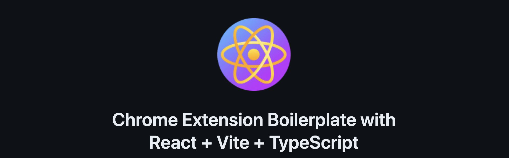
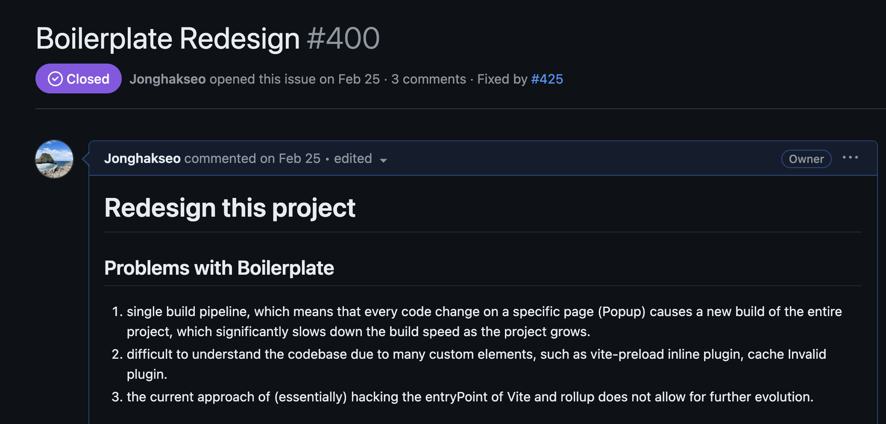
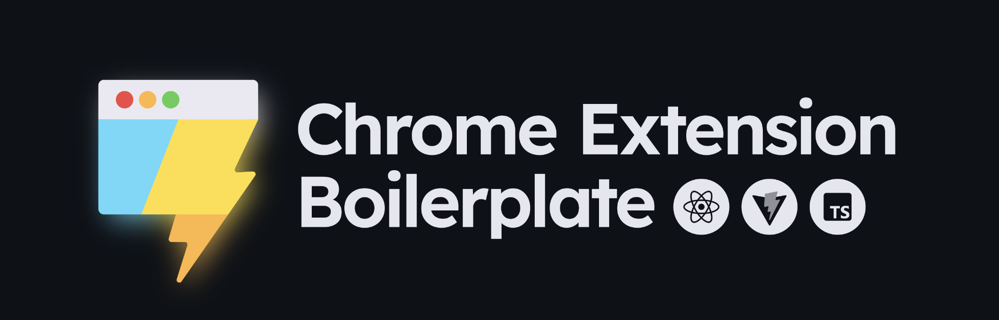

If you have already arrived here through that repository, you might be aware that I am maintaining an [open-source boilerplate](https://github.com/Jonghakseo/chrome-extension-boilerplate-react-vite) designed to facilitate the development of Chrome extensions.

When I first initiated this boilerplate project in early 2023,
my intention was simply to bring the experience of using Vite to Chrome extensions in a casual manner.
However, as I received a lot of encouragement and feedback, the project evolved significantly.


<a href="https://star-history.com/#Jonghakseo/chrome-extension-boilerplate-react-vite&Date">
 <picture>
   <source media="(prefers-color-scheme: dark)" srcset="https://api.star-history.com/svg?repos=Jonghakseo/chrome-extension-boilerplate-react-vite&type=Date&theme=dark" />
   <source media="(prefers-color-scheme: light)" srcset="https://api.star-history.com/svg?repos=Jonghakseo/chrome-extension-boilerplate-react-vite&type=Date" />
   
 </picture>
</a>

Recently, it even reached **2K stars** on GitHub.
To celebrate, I would like to take a moment to reflect on the project and share the insights I have gained through this journey.

## 1. Starting an open-source project



When I started this boilerplate project in early 2023, I was seeking a tool that could assist me in developing Chrome extensions.
However, I found the existing webpack-based boilerplate unappealing and monotonous.

I personally believed that Vite’s ecosystem had a lot of potential and wanted to explore using Vite for Chrome extension development.

## 2. Advancing the project

In the early stages, this project had a simple structure that enabled building Chrome extension pages (e.g., content scripts, new tabs, etc.) using React components with Vite and Rollup configurations.

Due to the unique nature of Chrome extension development (e.g., loading locally built files), I had to rebuild the project every time I made changes.
After each build, I also had to manually refresh the extension or the page to see the changes.

To address this inconvenience, I implemented a feature that automatically reloads the extension after each build.
I called this feature Hot Rebuild & Reload/Refresh (HRR) instead of Hot Module Replacement (HMR).
Implementing this feature was straightforward: I used websockets to trigger `chrome.runtime.reload()` or `window.location.reload()` after the build was completed.

Additionally, I added support for Manifest V3 and provided type support to help developers build more stable extensions.

[utils/vite.ts#L8-L16](https://github.com/Jonghakseo/chrome-extension-boilerplate-react-vite/blob/legacy/utils/vite.ts#L8-L16)

```typescript
export const getPlugins = (isDev: boolean): PluginOption[] => [
  makeManifest({ getCacheInvalidationKey }),
  customDynamicImport(),
  // You can toggle enable HMR in background script or view
  addHmr({ background: true, view: true, isDev }),
  isDev && watchRebuild({ afterWriteBundle: regenerateCacheInvalidationKey }),
  // For fix issue#177 (https://github.com/Jonghakseo/chrome-extension-boilerplate-react-vite/issues/177)
  inlineVitePreloadScript(),
];
```

But there were many issues with the project at that time. Due to my lack of understanding of Vite’s preload feature, there were import errors in some contexts of the extension that did not support module types.
Moreover, the build time increased as the project grew, because I had to rebuild the entire project whenever the one component changed.

Addressing these issues was challenging, and I often felt overwhelmed and questioned the potential and utility of the project.

Looking back, I realize that my personal issues overlapped with the external issues of the open-source project, which caused some fatigue.
But through this experience, I learned what to be cautious of and what to improve when operating an open-source project.
It is important not to be overwhelmed by psychological pressure and to review things slowly, meticulously, and with a sense of ease.

## 3. Receiving 1000 stars


While working on the project, I reached 1,000 stars on GitHub in November last year.
Receiving 1,000 stars made me reflect on the project and feel grateful for the encouragement and support from many people.

Some people emailed me to express their gratitude for creating the boilerplate, as it saved them time and effort.
Others expressed their willingness to contribute actively to the project and asked me to inform them if they needed help.
There were also people who provided feedback on the product through issues or added useful features through pull requests.

I have written about this in more detail on my other blog post titled [What I've learned from reaching 1K stars on GitHub](https://nookpi.tistory.com/188), so feel free to check it out if you are interested.
(Note: The blog post is written in Korean.)

I decided to continue developing the project with the encouragement and support of many people.
Although I had many ideas, I had hesitated to implement them due to expected time constraints.
I decided to redesign the project to address the fundamental limitations of the product.


[Boilerplate Redesign #400](https://github.com/Jonghakseo/chrome-extension-boilerplate-react-vite/issues/400)



## 4. Redesigning the project



When I developed the boilerplate, the most frustrating aspect was that the build time increased as the project grew.
Due to its structural limitations, I had to rebuild all pages, such as the Popup and Option pages, whenever the NewTab component changed.
This led to longer build times as the project scaled.

To address this issue, I redesigned the project structure to a monorepo structure and made it possible to build each page independently.
This allowed me to build only the changed pages and improve the reload/refresh process.
I also enhanced the HRR (Hot Rebuild & Reload/Refresh) feature to enable appropriate reload/refresh methods for each build context.

By leveraging the monorepo structure, I could develop and build each page independently, taking full advantage of the monorepo structure's benefits. Each page could be built and developed independently, and complex configurations and shared resources could be managed separately as packages.

I could easily use the Chrome extension's storage in each page and conveniently utilize native APIs, such as multi-language support, during the development process.

I could add these features without any burden, and each developer using the boilerplate could easily opt-out of unwanted features.

## 5. Contributors and Community

This project has grown to this point thanks to the contributions of many people in various forms.

To everyone who left an issue about a bug I hadn't thought of, who willingly submitted a Pull Request to fix a bug or add a helpful feature, who left their solution to other developers' issues in the comments, and who shared their discomfort or suggestions for improvement while using the boilerplate, I thank you all.

I also appreciate those who have expressed that this project has been helpful to them via personal emails, those who have expressed their willingness to contribute actively to this project, and those who have viewed me favorably and contacted me in various ways.

Recently, there has been a demand for a Discord channel where we can discuss issues and problems encountered while developing Chrome extensions, share tips and know-how, and grow together.
I have created a [Discord channel](https://discord.gg/EPrEF2us) where we can communicate and share our knowledge and experiences.

I hope this channel will become a community where many people can solve each other's problems, share their tips, and grow together.

## What I've learned

From starting this open-source project to operating it until now, I have learned a lot.

It's not just about how to operate an open-source project, but also about many technical aspects that have been helpful in my work at the company. This project has been a motivating factor for me to learn new technologies and has led to many proposals for collaboration in my work.

But most of all, the most rewarding part was being able to communicate with many people through this project, receive help from each other, and grow together. I will continue to make efforts to develop this project without getting tired and to improve it step by step.

I am grateful to everyone who supports and contributes to this project. Thank you. 🙏
