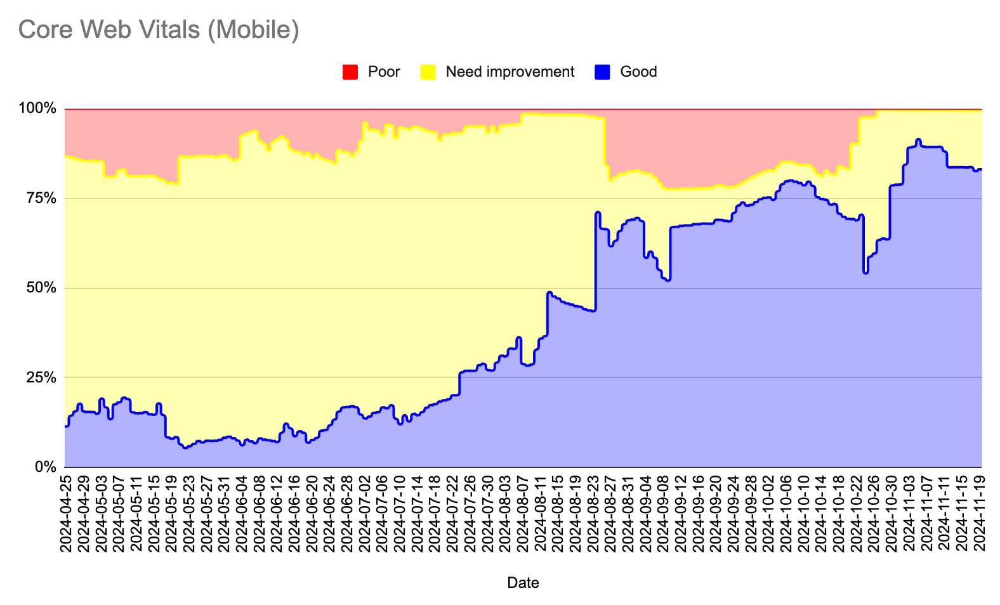
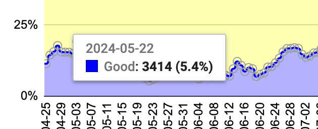
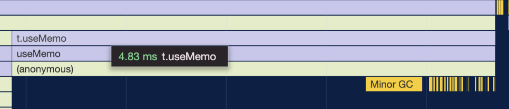
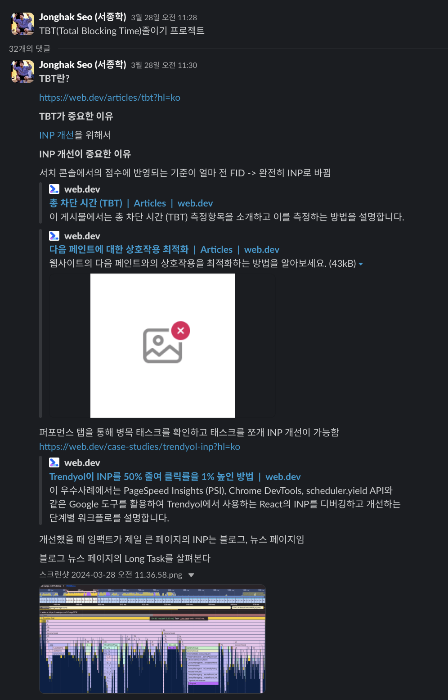
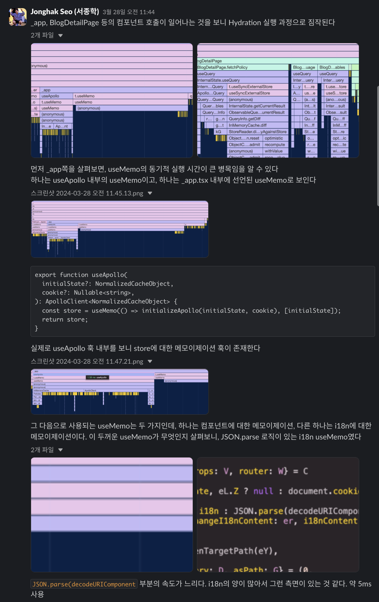
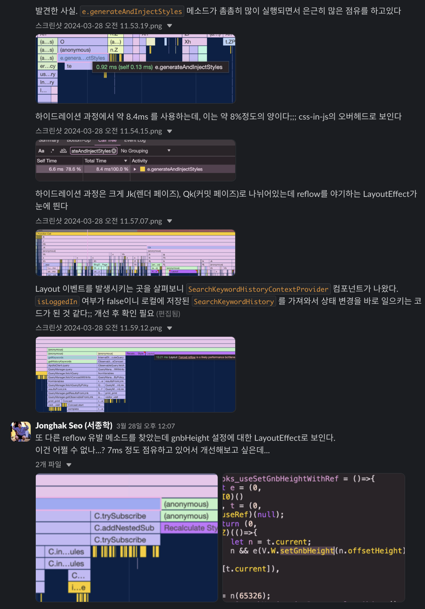
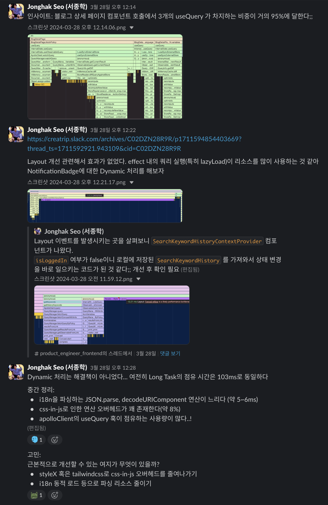
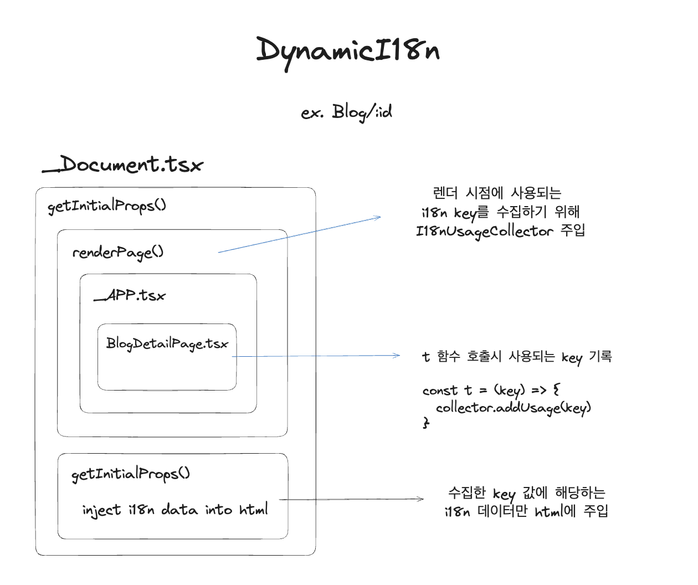
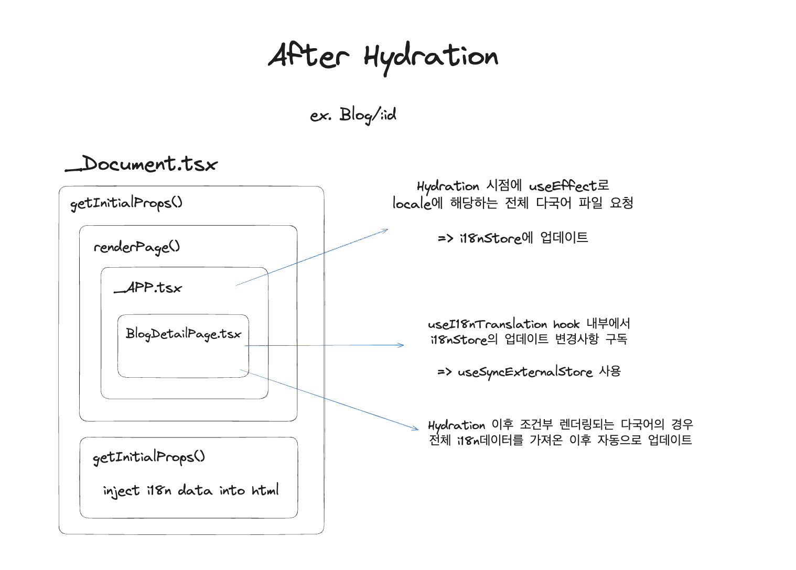
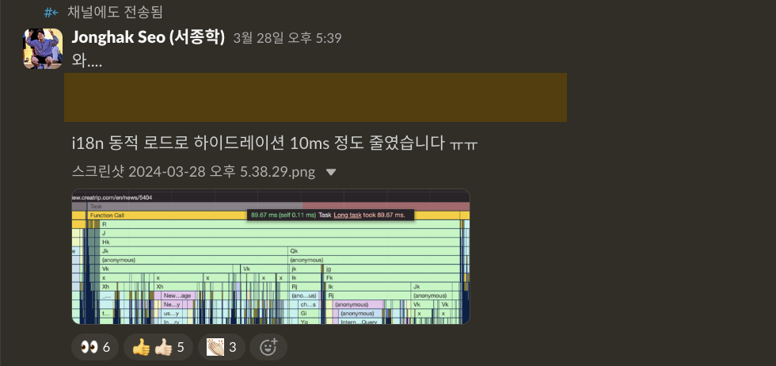

Before writing this year's retrospective, I want to document the work we've done to improve web vitals over the past year — more precisely, over the past 8 months.

Let's start with the results. There has been significant improvement based on Core Web Vitals metrics.

The Good ratio, which had dropped to 5% in early May, is now hovering around 80-90% as of November, maintaining a solid level.

These metrics are based on mobile. Given that our service has many mobile users and that mobile scoring criteria are stricter, we're focusing exclusively on mobile metrics. Desktop metrics naturally perform even better (Good ratio around 95%).

So what efforts did we make to achieve these improvements?

## 1. Dynamic i18n Data Loading

Of all the tasks we undertook to improve Core Web Vitals, I believe this one contributed the most to reducing TBT (INP).

Given our current service architecture where transitioning to App Router is structurally difficult, this task was our way of alleviating main thread bottlenecks.

In the existing implementation, all i18n files for a specific language were loaded at once to support multilingual content. While searching for main thread bottlenecks during hydration to improve TBT, we discovered that JSON.parse and decodeURLComponent operations — caused by the large file sizes — were having a surprisingly significant impact.

I jotted down some notes in a Slack thread during the problem analysis and hypothesis formation phase. Here's roughly what they looked like:

I roughly designed the implementation concept for the solution:

We improved the system to check which i18n keys are used during SSR/SSG rendering and only send down the values for those specific keys.

The remaining i18n data that isn't immediately needed is lazily fetched after hydration.

This work had two notable effects. First, it reduced the hydration overhead itself:

Second, by eliminating unnecessary i18n data from the network payload, the initial HTML size was dramatically reduced.

I believe this task had a positive impact not only on TBT but on overall metrics across the board.
