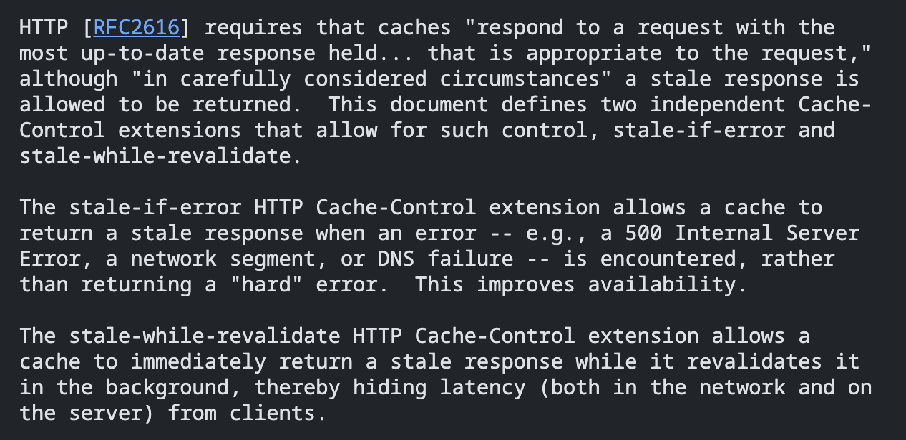
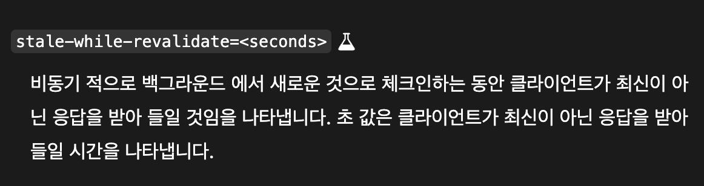
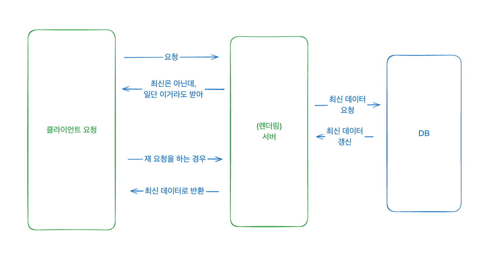

지난 2편의 글에 이어서 웹 바이탈 개선을 위해 했던 세 번째 작업에 대해 이야기해보려고 한다.

- [1편 - 다국어 동적 로드](/posts/web-vitals-improvement-1)
- [2편 - SSG 제거, SSR 전환](/posts/web-vitals-improvement-2)

### 3. SWR 적용

먼저 SWR 이란 stale-while-revalidate의 약자로 프론트엔드 생태계에는 vercel에서 만든 동명의 라이브러리가 있다. 참고로 같은 SWR이 맞다.

- [RFC 5861: HTTP Cache-Control Extensions for Stale Content](https://datatracker.ietf.org/doc/html/rfc5861)
- [SWR - 데이터 가져오기를 위한 React Hooks](https://swr.vercel.app/ko)

HTTP [RFC2616]는 캐시가 "요청에 적합한 가장 최신의 응답으로 응답해야 한다"고 요구하지만, "신중하게 고려된 상황"에서는 오래된 응답을 반환하는 것이 허용된다고 명시하고 있습니다. 이 문서는 이러한 제어를 가능하게 하는 두 개의 독립적인 Cache-Control 확장, stale-if-error와 stale-while-revalidate를 정의합니다.

stale-if-error HTTP Cache-Control 확장은 오류가 발생했을 때, 예를 들어 500 Internal Server Error, 네트워크 세그먼트, 또는 DNS 실패가 발생했을 때, "심각한" 오류를 반환하는 대신 오래된 응답을 반환할 수 있도록 캐시에게 허용합니다. 이는 가용성을 향상시킵니다.

**stale-while-revalidate HTTP Cache-Control 확장은 캐시가 백그라운드에서 응답을 재검증하는 동안 즉시 오래된 응답을 반환할 수 있도록 하여, 클라이언트로부터 네트워크 및 서버의 지연을 숨길 수 있게 합니다.**

어렵게 생각할 필요는 없고, SWR은 그냥 캐싱 전략이라고 이해하면 된다. 데이터를 최신화 하는 동안, 일단 들어온 요청에 대해 먼저 오래된 데이터를 주는 패턴이다. 같은 말로 '데이터를 재검증하는 동안에, 예전 데이터가 있으면 일단 그걸 준다' 는 말이다.

- [MDN - Cache-Control: stale-while-revalidate](https://developer.mozilla.org/ko/docs/Web/HTTP/Headers/Cache-Control#%ED%99%95%EC%9E%A5_cache-control_%EB%94%94%EB%A0%89%ED%8B%B0%EB%B8%8C)



이전 편에서 CDN 캐싱을 위해 SSR 응답에서 Cache-Control 헤더에 s-maxage를 넣었듯이, SWR을 사용하기 위해서는 Cache-Control 헤더에 stale-while-revalidate 헤더를 넣고 시간을 적어주면 된다.

```ts
export const setCDNCacheHeader = (
  res: ServerResponse,
  sMaxAge: number,
  staleWhileRevalidate?: number,
) => {
  // 1초 이내 요청은 캐시를 사용하고, 1초 이후에는 CDN 캐시를 사용한다.
  // 디스크 캐싱으로 발생할 수 있는 문제를 회피하고 컨텐츠의 최신화 여부를 CDN에 위임하는 방식.
  const cacheValue = [];
  cacheValue.push('public');
  cacheValue.push(`max-age=1`);
  cacheValue.push(`s-maxage=${sMaxAge}`);
  if (staleWhileRevalidate) {
    cacheValue.push(`stale-while-revalidate=${staleWhileRevalidate}`);
  }
  res.setHeader('Cache-Control', cacheValue.join(', '));
};

//...

// getServerSideProps 내부
setCDNCacheHeader(
  res,
  REVALIDATE_INTERVAL_SECONDS.THIRTY_MINUTES, // 30분
  STALE_WHILE_REVALIDATE_SECONDS.ONE_WEEK, // 1주일
);
```

위 코드는 다음과 같다.

1. 30분 이내의 페이지는 최신으로 간주하여 CDN에서 캐싱된 페이지를 제공한다.
2. 30분 이내의 페이지가 없다면, 1주일 이내의 페이지를 반환하고 내부적으로 새 페이지를 갱신한다.
3. 1주일 이내의 페이지가 없다면 새 페이지를 생성하길 기다렸다가 반환한다. (생성된 페이지는 캐싱)



SWR 헤더 적용은 단일 작업으로는 유저 경험에 가장 큰 임팩트를 준 작업이었다. 그야말로 가성비 최강! 9월에 프로덕션에 머지되었는데 이 시기 이후로 프로덕트의 전반적인 체감 속도가 크게 개선되었다. 실제 유저 경험에서도 응답속도가 개선되었다는 의견이 많아 개인적으로 매우 만족스러운 작업이었다.


